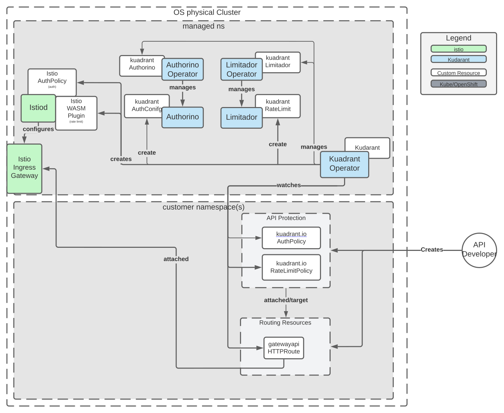

# Kuadrant Operator

[](https://github.com/Kuadrant/kuadrant-operator/actions/workflows/code-style.yaml)
[](https://github.com/Kuadrant/kuadrant-operator/actions/workflows/test.yaml)
[](https://codecov.io/gh/Kuadrant/kuadrant-operator)
[](http://www.apache.org/licenses/LICENSE-2.0)

The Operator to install and manage the lifecycle of the [Kuadrant](https://github.com/Kuadrant/) components deployments.

<!--ts-->
- [Overview](#overview)
- [Architecture](#architecture)
  - [Kuadrant components](#kuadrant-components)
  - [Provided APIs](#provided-apis)
- [Getting started](#getting-started)
  - [Pre-requisites](#pre-requisites)
  - [Installing Kuadrant](#installing-kuadrant)
    - [1. Install the Kuadrant Operator](#1-install-the-kuadrant-operator)
    - [2. Request a Kuadrant instance](#2-request-a-kuadrant-instance)
  - [Protect your service](#protect-your-service)
    - [If you are an *API Provider*](#if-you-are-an-api-provider)
    - [If you are a *Cluster Operator*](#if-you-are-a-cluster-operator)
- [User guides](#user-guides)
- [Kuadrant Rate Limiting](#kuadrant-rate-limiting)
- [Documentation](#documentation)
- [Contributing](#contributing)
- [Licensing](#licensing)

<!--te-->

## Overview

Kuadrant is a re-architecture of API Management using Cloud Native concepts and separating the components to be less coupled,
more reusable and leverage the underlying kubernetes platform. It aims to deliver a smooth experience to providers and consumers
of applications & services when it comes to rate limiting, authentication, authorization, discoverability, change management, usage contracts, insights, etc.

Kuadrant aims to produce a set of loosely coupled functionalities built directly on top of Kubernetes.
Furthermore, it only strives to provide what Kubernetes doesn’t offer out of the box, i.e. Kuadrant won’t be designing a new Gateway/proxy,
instead it will opt to connect with what’s there and what’s being developed (think Envoy, Istio, GatewayAPI).

Kuadrant is a system of cloud-native k8s components that grows as users’ needs grow.

* From simple protection of a Service (via **AuthN**) that is used by teammates working on the same cluster, or “sibling” services, up to **AuthZ** of users using OIDC plus custom policies.
* From no rate-limiting to rate-limiting for global service protection on to rate-limiting by users/plans

## Architecture

Kuadrant relies on [Istio](https://istio.io/) and the [Gateway API](https://gateway-api.sigs.k8s.io/)
to operate the cluster (Istio's) ingress gateway to provide API management with **authentication** (authN),
**authorization** (authZ) and **rate limiting** capabilities.

### Kuadrant components

| CRD                                                                  | Description                                                                                                                                                                                                                                                                               |
|----------------------------------------------------------------------|-------------------------------------------------------------------------------------------------------------------------------------------------------------------------------------------------------------------------------------------------------------------------------------------|
| Control Plane                                                        | The control plane takes the customer desired configuration (declaratively as kubernetes custom resources) as input and ensures all components are configured to obey customer's desired behavior.<br> This repository contains the source code of the kuadrant control plane              |
| [Kuadrant Operator](https://github.com/Kuadrant/kuadrant-operator)   | A Kubernetes Operator to manage the lifecycle of the kuadrant deployment                                                                                                                                                                                                                  |
| [Authorino](https://github.com/Kuadrant/authorino)                   | The AuthN/AuthZ enforcer. As the [external istio authorizer](https://istio.io/latest/docs/tasks/security/authorization/authz-custom/) ([envoy external authorization](https://www.envoyproxy.io/docs/envoy/latest/configuration/http/http_filters/ext_authz_filter) serving gRPC service) |
| [Limitador](https://github.com/Kuadrant/limitador)                   | The external rate limiting service. It exposes a gRPC service implementing the [Envoy Rate Limit protocol (v3)](https://www.envoyproxy.io/docs/envoy/latest/api-v3/service/ratelimit/v3/rls.proto)                                                                                        |
| [Authorino Operator](https://github.com/Kuadrant/authorino-operator) | A Kubernetes Operator to manage Authorino instances                                                                                                                                                                                                                                       |
| [Limitador Operator](https://github.com/Kuadrant/limitador-operator) | A Kubernetes Operator to manage Limitador instances                                                                                                                                                                                                                                       |

### Provided APIs

The kuadrant control plane owns the following [Custom Resource Definitions, CRDs](https://kubernetes.io/docs/tasks/extend-kubernetes/custom-resources/custom-resource-definitions/):

| CRD                                                                                                 | Description                                                    | Example                                                                                                                                  |
|-----------------------------------------------------------------------------------------------------|----------------------------------------------------------------|------------------------------------------------------------------------------------------------------------------------------------------|
| AuthPolicy CRD [\[doc\]](doc/auth.md) [[reference]](doc/reference/authpolicy.md)                    | Enable AuthN and AuthZ based access control on workloads       | [AuthPolicy CR](https://github.com/Kuadrant/kuadrant-operator/blob/main/examples/toystore/authpolicy.yaml)                               |
| RateLimitPolicy CRD [\[doc\]](doc/rate-limiting.md) [[reference]](doc/reference/ratelimitpolicy.md) | Enable access control on workloads based on HTTP rate limiting | [RateLimitPolicy CR](https://raw.githubusercontent.com/Kuadrant/kuadrant-operator/main/examples/toystore/ratelimitpolicy_httproute.yaml) |

Additionally, Kuadrant provides the following CRDs

| CRD                                                                                                          | Owner                                                                | Description                         | Example                                                                                                                           |
|--------------------------------------------------------------------------------------------------------------|----------------------------------------------------------------------|-------------------------------------|-----------------------------------------------------------------------------------------------------------------------------------|
| [Kuadrant CRD](https://github.com/Kuadrant/kuadrant-operator/blob/main/api/v1beta1/kuadrant_types.go)        | [Kuadrant Operator](https://github.com/Kuadrant/kuadrant-operator)   | Represents an instance of kuadrant  | [Kuadrant CR](https://github.com/Kuadrant/kuadrant-operator/blob/main/config/samples/kuadrant_v1beta1_kuadrant.yaml)              |
| [Limitador CRD](https://github.com/Kuadrant/limitador-operator/blob/main/api/v1alpha1/limitador_types.go)    | [Limitador Operator](https://github.com/Kuadrant/limitador-operator) | Represents an instance of Limitador | [Limitador CR](https://github.com/Kuadrant/limitador-operator/blob/main/config/samples/limitador_v1alpha1_limitador.yaml)         |
| [Authorino CRD](https://github.com/Kuadrant/authorino-operator#the-authorino-custom-resource-definition-crd) | [Authorino Operator](https://github.com/Kuadrant/authorino-operator) | Represents an instance of Authorino | [Authorino CR](https://github.com/Kuadrant/authorino-operator/blob/main/config/samples/authorino-operator_v1beta1_authorino.yaml) |



## Getting started

### Pre-requisites

* Istio is installed in the cluster. Otherwise, refer to the
  [Istio getting started guide](https://istio.io/latest/docs/setup/getting-started/).
* Kubernetes Gateway API is installed in the cluster. Otherwise,
  [configure Istio to expose a service using the Kubernetes Gateway API](https://istio.io/latest/docs/tasks/traffic-management/ingress/gateway-api/).

### Installing Kuadrant

Installing Kuadrant is a two-step procedure. Firstly, install the Kuadrant Operator and secondly,
request a Kuadrant instance by creating a *Kuadrant* custom resource.

#### 1. Install the Kuadrant Operator

The Kuadrant Operator is available in public community operator catalogs, such as the Kubernetes [OperatorHub.io](https://operatorhub.io/operator/kuadrant-operator) and the [Openshift Container Platform and OKD OperatorHub](https://redhat-openshift-ecosystem.github.io/community-operators-prod).

**Kubernetes**

The operator is available from [OperatorHub.io](https://operatorhub.io/operator/kuadrant-operator).
Just go to the linked page and follow installation steps (or just run these two commands):

```sh
# Install Operator Lifecycle Manager (OLM), a tool to help manage the operators running on your cluster.

curl -sL https://github.com/operator-framework/operator-lifecycle-manager/releases/download/v0.23.1/install.sh | bash -s v0.23.1

# Install the operator by running the following command:

kubectl create -f https://operatorhub.io/install/kuadrant-operator.yaml
```

**Openshift**

The operator is available from the [Openshift Console OperatorHub](https://docs.openshift.com/container-platform/4.11/operators/user/olm-installing-operators-in-namespace.html#olm-installing-from-operatorhub-using-web-console_olm-installing-operators-in-namespace).
Just follow installation steps choosing the "Kuadrant Operator" from the catalog:


#### 2. Request a Kuadrant instance

Create the namespace:

```sh
kubectl create namespace kuadrant
```

Apply the `Kuadrant` custom resource:

```sh
kubectl -n kuadrant apply -f - <<EOF
---
apiVersion: kuadrant.io/v1beta1
kind: Kuadrant
metadata:
  name: kuadrant-sample
spec: {}
EOF
```

### Protect your service

#### If you are an *API Provider*

* Deploy the service/API to be protected ("Upstream")
* Expose the service/API using the kubernetes Gateway API, ie
  [HTTPRoute](https://gateway-api.sigs.k8s.io/reference/spec/#gateway.networking.k8s.io/v1.HTTPRoute) object.
* Write and apply the Kuadrant's [RateLimitPolicy](doc/rate-limiting.md) and/or
  [AuthPolicy](doc/auth.md) custom resources targeting the HTTPRoute resource
  to have your API protected.

#### If you are a *Cluster Operator*

* (Optionally) deploy istio ingress gateway using the
  [Gateway](https://gateway-api.sigs.k8s.io/reference/spec/#gateway.networking.k8s.io/v1.Gateway) resource.
* Write and apply the Kuadrant's [RateLimitPolicy](doc/rate-limiting.md) and/or
  [AuthPolicy](doc/auth.md) custom resources targeting the Gateway resource
  to have your gateway traffic protected.

## User guides

The user guides section of the docs gathers several use-cases as well as the instructions to implement them using kuadrant.

* [Simple Rate Limiting for Application Developers](doc/user-guides/simple-rl-for-app-developers.md)
* [Authenticated Rate Limiting for Application Developers](doc/user-guides/authenticated-rl-for-app-developers.md)
* [Gateway Rate Limiting for Cluster Operators](doc/user-guides/gateway-rl-for-cluster-operators.md)
* [Authenticated Rate Limiting with JWTs and Kubernetes RBAC](doc/user-guides/authenticated-rl-with-jwt-and-k8s-authnz.md)

## [Kuadrant Rate Limiting](doc/rate-limiting.md)

## Documentation

Docs can be found on the [Kuadrant website](https://kuadrant.io/).

## Contributing

The [Development guide](doc/development.md) describes how to build the kuadrant operator and
how to test your changes before submitting a patch or opening a PR.

Join us on the [#kuadrant](https://kubernetes.slack.com/archives/C05J0D0V525) channel in the Kubernetes Slack workspace,
for live discussions about the roadmap and more.

## Licensing

This software is licensed under the [Apache 2.0 license](https://www.apache.org/licenses/LICENSE-2.0).

See the LICENSE and NOTICE files that should have been provided along with this software for details.
