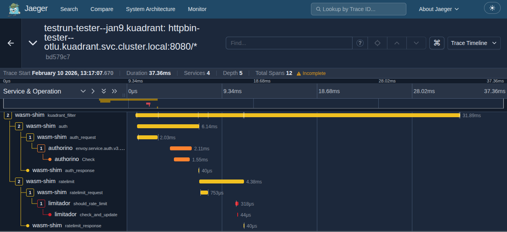
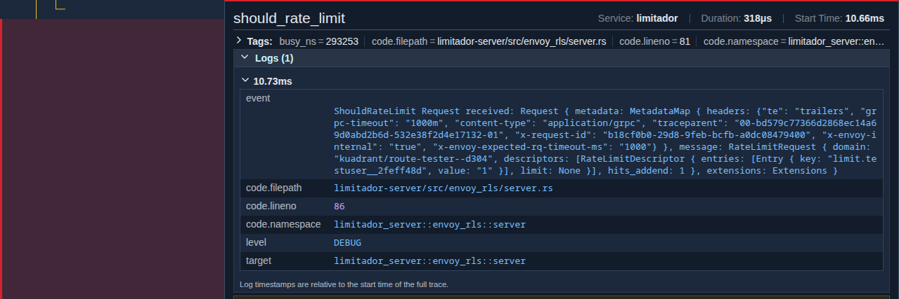

# Enabling tracing with a central collector

## Introduction

This guide outlines the steps to enable tracing in Istio and Kuadrant components (Authorino, Limitador, and wasm-shim), directing traces to a central collector for improved observability and troubleshooting. We'll also explore a typical troubleshooting flow using traces and logs.

## Prerequisites

- A Kubernetes cluster with Istio and Kuadrant installed.
- A trace collector (e.g., Jaeger or Tempo) configured to support [OpenTelemetry](https://opentelemetry.io/) (OTel).

## Configuration Steps

### Istio Tracing Configuration

Enable tracing in Istio by using the [Telemetry API](https://istio.io/v1.20/docs/tasks/observability/distributed-tracing/telemetry-api/).
Depending on your method for installing Istio, you will need to configure a tracing `extensionProvider` in your MeshConfig, Istio or IstioOperator resource as well.
Here is an example Telemetry and Istio config to sample 100% of requests, if using the Istio Sail Operator.

```yaml
apiVersion: telemetry.istio.io/v1alpha1
kind: Telemetry
metadata:
  name: mesh-default
  namespace: gateway-system
spec:
  tracing:
  - providers:
    - name: jaeger-collector
    randomSamplingPercentage: 100
---
apiVersion: sailoperator.io/v1
kind: Istio
metadata:
  name: default
spec:
  namespace: gateway-system
  values:
    meshConfig:
      defaultConfig:
        tracing: {}
      enableTracing: true
      extensionProviders:
      - name: jaeger-collector
        opentelemetry:
          port: 4317
          service: jaeger-collector.jaeger.svc.cluster.local
```

**Important:**

The OpenTelemetry collector protocol should be explicitly set in the service port `name` or `appProtocol` fields as per the [Istio documentation](https://istio.io/latest/docs/ops/configuration/traffic-management/protocol-selection/#explicit-protocol-selection). For example, when using gRPC, the port `name` should begin with `grpc-` or the `appProtocol` should be `grpc`.

### Kuadrant Tracing Configuration

Kuadrant components (Authorino, Limitador, and Wasm-shim) have request tracing capabilities.
Configure tracing centrally via the Kuadrant CR to automatically propagate the configuration to all components.
Ensure the collector is the same one that Istio is sending traces so that they can be correlated later.

#### Kuadrant CR Configuration

Configure tracing centrally in the Kuadrant CR. This configuration will be automatically propagated to:
- **Authorino** (Auth service - authentication decisions)
- **Limitador** (Rate limiting service - rate limit checks)
- **Wasm-shim** (Envoy WebAssembly filter - gateway-level tracing)

```yaml
apiVersion: kuadrant.io/v1beta1
kind: Kuadrant
metadata:
  name: kuadrant
  namespace: kuadrant-system
spec:
  observability:
    dataPlane:
      defaultLevels:
        - debug: "true"  # Enable DEBUG level trace filtering
      httpHeaderIdentifier: x-request-id
    tracing:
      defaultEndpoint: rpc://jaeger-collector.jaeger.svc.cluster.local:4317
      insecure: true
```

**Tracing Configuration Fields:**

- `defaultEndpoint`: The URL of the tracing collector backend (OTLP endpoint). Supported protocols:
  - `rpc://` for gRPC OTLP (port 4317)
  - `http://` for HTTP OTLP (port 4318)
- `insecure`: Set to `true` to skip TLS certificate verification (useful for development environments).

**Important:** Point to the **collector** service (e.g., `jaeger-collector`), not the query service. The collector receives traces from your applications, while the query service is only for viewing traces in the UI.

Once applied, the Authorino and Limitador components will be redeployed with tracing enabled.

**Data Plane Configuration Fields:**

- `defaultLevels`: Controls the **OpenTelemetry trace filtering level** for the wasm-shim. This determines which trace spans are exported to your tracing collector.
  - Supported levels (highest to lowest verbosity): `debug`, `info`, `warn`, `error`
  - **Current implementation (MVP)**: Set to `"true"` to enable that level (e.g., `debug: "true"`)
  - **Future**: Will support CEL expressions for dynamic request-time evaluation
  - Default: `WARN` if not specified
  - Priority: DEBUG > INFO > WARN > ERROR (highest level set wins)

- `httpHeaderIdentifier`: Specifies the HTTP header name used to correlate requests in traces (e.g., `x-request-id`)

**Important - Understanding what `defaultLevels` controls:**

The `defaultLevels` configuration controls **trace span filtering** sent to your observability backend (Jaeger, Tempo, etc.), **not** the verbosity of logs appearing in gateway pod output.

- **To view traces**: Configure `defaultLevels` in the Kuadrant CR and view traces in your tracing UI (Jaeger/Grafana)
- **To see debug logs in gateway pods**: Configure Envoy's log level separately (see [Enabling Gateway Debug Logs](#enabling-gateway-debug-logs) in the troubleshooting section)

#### Direct Configuration (Advanced)

For advanced use cases, you can configure tracing directly in the Authorino or Limitador CRs:

```yaml
apiVersion: operator.authorino.kuadrant.io/v1beta1
kind: Authorino
metadata:
  name: authorino
spec:
  tracing:
    endpoint: rpc://authorino-collector:4317
    insecure: true
---
apiVersion: limitador.kuadrant.io/v1alpha1
kind: Limitador
metadata:
  name: limitador
spec:
  tracing:
    endpoint: rpc://limitador-collector:4317
```

**Important:** When tracing is configured directly in Authorino or Limitador CRs, those settings take precedence over the Kuadrant CR configuration. The Kuadrant operator will cede ownership of the tracing field to you, allowing full control over component-specific tracing endpoints. This is useful when you need different collectors for different components.

#### Configuration Precedence

The tracing configuration follows this precedence order:

1. **Component-specific configuration** (Authorino/Limitador CR) - highest priority
2. **Centralized configuration** (Kuadrant CR) - applies when component CRs don't specify tracing

If you set tracing in the Kuadrant CR and later configure it directly in an Authorino or Limitador CR, the component-specific configuration will take precedence, and the Kuadrant operator will no longer manage that component's tracing settings.

**Note on Trace Continuity:**

Currently, trace IDs [do not propagate](https://github.com/envoyproxy/envoy/issues/22028) to WebAssembly modules in Istio/Envoy. This affects trace continuity when rate limiting is enforced, as requests may not have the relevant 'parent' trace ID in their trace information.

However, if the trace initiation point is outside of Envoy/Istio, the 'parent' trace ID will be available and included in traces passed to the collector. This limitation can impact correlating traces across the gateway, auth service, rate limiting, and other components in the request path.

Despite this, Kuadrant configures tracing for the wasm-shim when using the centralized configuration, ensuring that trace data is collected even if parent-child relationships may be limited in some scenarios.

## Control Plane Tracing

The Kuadrant operator itself (the control plane) exports traces to your OpenTelemetry collector, allowing you to observe the operator's reconciliation loops and internal operations. This is useful for debugging controller behavior, understanding operator performance, and tracking policy lifecycle events.

**Note:** Control plane tracing may already be enabled in your installation. Check if you can see `kuadrant-operator` service in your tracing UI before configuring.

### Enabling Control Plane Tracing

The Kuadrant operator exposes OpenTelemetry environment variables for control plane tracing. To enable control plane tracing, you need to set these environment variables in your operator deployment. The method for setting these will depend on your deployment approach (e.g., using Kustomize, Helm, OLM, or direct YAML manifests).

**Available environment variables:**

| Environment Variable                    | Description                                                                                                        | Default                      |
| --------------------------------------- | ------------------------------------------------------------------------------------------------------------------ | ---------------------------- |
| `OTEL_EXPORTER_OTLP_ENDPOINT`           | OTLP collector endpoint for all signals (logs, traces, metrics). Supports `http://`, `https://`, `rpc://` schemes | - (tracing disabled)         |
| `OTEL_EXPORTER_OTLP_TRACES_ENDPOINT`    | OTLP traces-specific endpoint (overrides `OTEL_EXPORTER_OTLP_ENDPOINT`)                                            | -                            |
| `OTEL_EXPORTER_OTLP_INSECURE`           | Disable TLS for OTLP export                                                                                        | `false`                      |
| `OTEL_SERVICE_NAME`                     | Service name for telemetry data                                                                                    | `kuadrant-operator`          |
| `OTEL_SERVICE_VERSION`                  | Service version for telemetry data                                                                                 | Build version (from ldflags) |

**Note:** Tracing is enabled when either `OTEL_EXPORTER_OTLP_ENDPOINT` or `OTEL_EXPORTER_OTLP_TRACES_ENDPOINT` is set to a non-empty value.

**Example values:**
- `OTEL_EXPORTER_OTLP_ENDPOINT=rpc://jaeger-collector.jaeger.svc.cluster.local:4317`
- `OTEL_EXPORTER_OTLP_INSECURE=true` (use `false` in production with TLS)

Control plane traces will appear under service name `kuadrant-operator` in Jaeger/Grafana.

#### Authorino

[Authorino control plane tracing](https://github.com/Kuadrant/authorino/blob/main/docs/user-guides/observability.md#control-plane-tracing) is automatically enabled when data plane tracing is configured via the Kuadrant CR. When enabled, 
Authorino will attempt to link `AuthConfig` reconciliation traces with traces from the Kuadrant operator through 
[trace context propagation](https://github.com/Kuadrant/authorino/blob/main/docs/user-guides/observability.md#linking-parent-traces-for-authconfig). 
This linking requires Kuadrant operator control plane tracing to also be enabled.

#### Limitador Operator

[Limitador Operator control plane tracing](https://github.com/Kuadrant/limitador-operator/blob/main/doc/tracing.md#control-plane-tracing-limitador-operator) can be enabled using the 
same environment variable configuration as the Kuadrant operator.

When enabled, the Limitador Operator will attempt to link `Limitador` reconciliation traces with traces from the Kuadrant operator 
through [trace context propagation](https://github.com/Kuadrant/limitador-operator/blob/main/doc/tracing.md#trace-context-propagation). 
This linking requires Kuadrant operator control plane tracing to also be enabled.

### Control Plane vs Data Plane Tracing

Kuadrant supports tracing at two levels:

1. **Control Plane Tracing** (this section): Traces the operator's reconciliation loops and internal operations
   - Shows policy lifecycle events, topology building, resource creation
   - Helps debug operator behavior and performance

2. **Data Plane Tracing** (see configuration above): Traces actual user requests through the gateway and policy enforcement components
   - Shows request flows through Istio/Envoy, Authorino, Limitador, and wasm-shim
   - Helps debug request-level issues and policy enforcement

**Configuration:**
- **Control Plane**: Configured via environment variables in the operator deployment (see "Enabling Control Plane Tracing" above)
- **Data Plane**: Configured via the Kuadrant CR (`spec.observability.tracing`)

When both are configured to send traces to the same collector, you get a complete view of your Kuadrant system from policy reconciliation to request processing.

### What Control Plane Traces Show

Control plane traces capture operator activities such as:

- **Policy reconciliation**: When a policy (AuthPolicy, RateLimitPolicy, DNSPolicy, TLSPolicy) is created, updated, or deleted
- **Resource creation**: Creating Authorino AuthConfigs, Limitador configurations, wasm-shim, etc.
- **Gateway topology discovery**: Analyzing Gateway API resources and computing policy attachments
- **Status updates**: Updating policy status conditions
- **Conflict detection**: Detecting and resolving policy conflicts
- **Error handling**: Tracking reconciliation errors and retries

These traces are separate from data plane traces (actual user requests) and help operators understand what the Kuadrant operator is doing behind the scenes.

### Viewing Control Plane Traces

Once control plane tracing is enabled, you can view operator traces in Jaeger or Grafana:

**Using Jaeger UI:**

1. Port-forward to Jaeger Query service:
   ```bash
   kubectl port-forward -n <jaeger-namespace> svc/jaeger-query 16686:80
   ```

   Or if using the Jaeger all-in-one deployment:
   ```bash
   kubectl port-forward -n <jaeger-namespace> svc/jaeger 16686:16686
   ```

2. Open http://localhost:16686

3. Select service: **kuadrant-operator**

4. Search for traces by:
   - **Operation name**: Look for operations like `controller.reconcile`, `workflow.data_plane_policies`
   - **Tags**: Filter by specific policy using `policy.name=my-policy-name`
   - **Duration**: Find slow reconciliations (e.g., min duration > 100ms)

**Example searches:**

Find all traces for a specific RateLimitPolicy:
```
Service: kuadrant-operator
Tags: policy.name=my-ratelimitpolicy
```

Find slow reconciliations for data plane policies:
```
Service: kuadrant-operator
Operation: workflow.data_plane_policies
Min Duration: 100ms
```

**Example Trace Spans:**

A typical reconciliation loop generates traces showing the workflow structure:

```
controller.reconcile (29.8ms)
├─ topology.build (495µs)
├─ workflow.init (12.56ms)
│  └─ init.topology_reconciler (10.41ms)
├─ workflow.data_plane_policies (15.73ms)
│  ├─ validation (72µs)
│  ├─ effective_policies (3.01ms)
│  │  ├─ effective_policies.auth
│  │  ├─ effective_policies.ratelimit
│  │  └─ effective_policies.token_ratelimit
│  ├─ reconciler.auth_configs (293µs)
│  ├─ reconciler.limitador_limits (216µs)
│  └─ wasm.BuildConfigForPath (142µs)
└─ status_update (12.64ms)
```

The trace structure reflects the operator's workflow-based reconciliation:

**Main Workflows:**
- **controller.reconcile**: Main reconciliation entry point for all policy changes
- **topology.build**: Building the Gateway API topology graph
- **workflow.init**: Initialization workflow (topology reconciliation, event logging)
- **workflow.data_plane_policies**: Auth and rate limiting policy reconciliation
- **workflow.dns**: DNS policy reconciliation (when DNS policies are present)
- **workflow.tls**: TLS policy reconciliation (when TLS policies are present)
- **workflow.observability**: Observability configuration reconciliation
- **workflow.limitador**: Limitador deployment reconciliation (when Limitador operator is installed)
- **workflow.authorino**: Authorino deployment reconciliation (when Authorino operator is installed)
- **status_update**: Final workflow for updating policy statuses

**Data Plane Policy Workflow Spans:**
- **validation**: Validates AuthPolicy, RateLimitPolicy, TokenRateLimitPolicy resources
- **effective_policies**: Computes effective policies for each HTTPRoute and Gateway
  - `effective_policies.auth`: Effective auth policies
  - `effective_policies.ratelimit`: Effective rate limit policies
  - `effective_policies.token_ratelimit`: Effective token rate limit policies
- **reconciler.auth_configs**: Reconciles Authorino AuthConfig resources
- **reconciler.limitador_limits**: Reconciles Limitador limit configurations
- **reconciler.istio_extension**: Reconciles Istio WasmPlugin and EnvoyFilter resources (when Istio is the gateway provider)
- **reconciler.envoy_gateway_extension**: Reconciles Envoy Gateway extension policies (when Envoy Gateway is the provider)
- **wasm.BuildConfigForPath**: Builds wasm-shim configuration for a specific HTTPRoute path

### Tracing Policy Lifecycle

To trace a specific policy creation or update:

1. **Create or update a policy**:
   ```bash
   kubectl apply -f my-ratelimitpolicy.yaml
   ```

2. **Get the policy creation/update timestamp**:
   ```bash
   kubectl get ratelimitpolicy my-policy -o jsonpath='{.metadata.creationTimestamp}'
   ```

3. **Search in Jaeger**:
   - Set the time range around the policy change timestamp
   - Look for operation: `controller.reconcile`
   - Expand the trace to see workflow details like `workflow.data_plane_policies`
   - Look for specific reconciler spans like `reconciler.limitador_limits` or `reconciler.auth_configs`
   - Check timing information to identify performance bottlenecks

### Correlating Control Plane and Data Plane Traces

While control plane and data plane traces are separate, you can correlate them:

1. **Control plane trace**: Shows when a policy was reconciled and resources created
2. **Data plane trace**: Shows actual user requests processed with that policy

Example workflow:
1. Create a RateLimitPolicy at `15:30:00`
2. View control plane trace to see:
   - Policy reconciliation completed at `15:30:05`
   - Limitador configuration updated
   - WASM plugin deployed
3. Send a test request at `15:30:10`
4. View data plane trace to see:
   - Request processed through the wasm-shim
   - Rate limit check sent to Limitador
   - Response returned

### Local Development

For local development, you can run the operator with control plane tracing enabled by setting environment variables:

```bash
# Start Jaeger or an OTel collector
docker compose -f examples/otel/docker-compose.yaml up -d

# Run the operator with OpenTelemetry enabled
# Note: When running locally, env vars are used instead of the Kuadrant CR
export OTEL_EXPORTER_OTLP_INSECURE=true
export OTEL_EXPORTER_OTLP_ENDPOINT=http://localhost:4318
make run

# View traces in Jaeger (http://localhost:16686)
```

**Note:** Control plane tracing is always configured via environment variables (whether running locally or in-cluster). Data plane tracing is configured via the Kuadrant CR.

See the [OpenTelemetry example](../../examples/otel/README.md) for complete local development setup with Grafana, Tempo, Jaeger, Loki, and Prometheus.

### Configuration Notes

When you configure tracing via the Kuadrant CR (`spec.observability.tracing`), it automatically enables tracing for:
- **Data Plane**: Authorino, Limitador, and Wasm-shim

For **control plane tracing** (the operator's reconciliation loops), you must configure environment variables in the operator deployment as described in the section above.

The combination of control plane environment variables and Kuadrant CR data plane configuration provides complete tracing across your entire Kuadrant deployment.

### Troubleshooting Control Plane Tracing

**Traces not appearing in Jaeger:**

1. Check if tracing is configured in the Kuadrant CR:
   ```bash
   kubectl get kuadrant kuadrant -n kuadrant-system -o jsonpath='{.spec.observability.tracing}'
   ```

   Expected output should show `defaultEndpoint` configured:
   ```json
   {"defaultEndpoint":"rpc://jaeger-collector.jaeger.svc.cluster.local:4317","insecure":true}
   ```

2. Check operator logs for OTLP connection errors:
   ```bash
   kubectl logs -n kuadrant-system -l control-plane=controller-manager --tail=50 | grep -i otel
   ```

3. Verify the tracing collector endpoint is reachable from the operator:
   ```bash
   # For HTTP OTLP endpoint (port 4318)
   kubectl exec -n kuadrant-system deployment/kuadrant-operator-controller-manager -- \
     curl -v http://jaeger-collector.jaeger.svc.cluster.local:4318/v1/traces
   ```

4. Test sending traces to the collector directly:
   ```bash
   # Port-forward to the collector for local testing
   kubectl port-forward -n <jaeger-namespace> svc/jaeger-collector 4318:4318

   # Send a test trace
   curl -X POST http://localhost:4318/v1/traces \
     -H "Content-Type: application/json" \
     -d '{"resourceSpans":[]}'
   ```

**Traces are incomplete or missing spans:**

- Check for errors in the operator logs that might indicate reconciliation failures
- Verify the collector is not dropping spans due to rate limiting or storage issues
- Check the collector's own logs for processing errors

## Understanding Data Plane Traces

### Prerequisites

Before you can view data plane traces, ensure you have:

1. **Tracing collector deployed** - Jaeger, Tempo, or another OTLP-compatible collector
2. **Kuadrant CR configured with tracing endpoint**:
   ```yaml
   spec:
     observability:
       tracing:
         defaultEndpoint: rpc://jaeger-collector.jaeger.svc.cluster.local:4317
   ```
3. **At least one policy applied** - AuthPolicy or RateLimitPolicy on a Gateway or HTTPRoute
4. **Traffic flowing through the gateway** - Send requests to see traces

Without these prerequisites, you won't see traces in your tracing UI even if `defaultLevels` is configured.

### What You'll See

When data plane tracing is enabled with `defaultLevels: debug`, you'll see detailed trace spans showing the complete request flow through Kuadrant components.

### Example: Complete Request Trace

Here's what a typical traced request looks like when it flows through auth and rate limiting policies:

```text
Request Flow (29.4ms total):
│
├─ Envoy Gateway Span (34.7ms)
│  └─ kuadrant_filter (29.4ms)
│     │
│     ├─ auth (6.8ms)
│     │  ├─ auth_request (1.2ms)
│     │  │  └─ Authorino gRPC Call
│     │  │     └─ envoy.service.auth.v3.Authorization/Check (2.0ms)
│     │  │        └─ Check (1.7ms)
│     │  └─ auth_response (56μs)
│     │
│     └─ ratelimit (6.0ms)
│        ├─ ratelimit_request (576μs)
│        │  └─ Limitador gRPC Call
│        │     └─ should_rate_limit (309μs)
│        │        └─ check_and_update (36μs)
│        └─ ratelimit_response (38μs)
│
└─ Backend Service: httpbin (34.7ms)
```

### Trace Attributes You'll See

Data plane traces include rich context from multiple services:

**Wasm-shim Spans** (service: `wasm-shim`):
- Request correlation IDs from `httpHeaderIdentifier` configuration
- Matched hostname and route configuration details
- Policy attribution showing which AuthPolicy/RateLimitPolicy rules were evaluated
- At DEBUG level: Detailed gRPC call information, property updates, and header manipulations

**Authorino Spans** (service: `authorino`):
- Request ID correlation
- gRPC service calls and status codes
- Authentication and authorization decision details

**Limitador Spans** (service: `limitador`):
- Rate limit check requests with trace context
- Limit descriptors and counter information

### Viewing This Trace in Jaeger

**Search by Request ID:**
```text
Service: wasm-shim
Tags: request_id=adefc8cf-78af-9db7-97e5-5ae5e2b22c05
```

**Filter by Operation:**
```text
Service: wasm-shim
Operation: kuadrant_filter
Min Duration: 10ms
```

**Examine Specific Policy:**
```text
Service: wasm-shim
Tags: sources=authpolicy.kuadrant.io:kuadrant/my-auth-policy
```

### What This Shows You

1. **Complete Request Timeline**: See exactly how long each component took
   - Auth check: 6.8ms (including Authorino processing)
   - Rate limit check: 6.0ms (including Limitador processing)
   - Total protection time: 12.8ms (wasm-shim)

2. **Request Correlation**: Request IDs flow across all services (wasm-shim, Authorino, Limitador) for end-to-end tracing

3. **Policy Attribution**: Trace attributes identify which policies (AuthPolicy, RateLimitPolicy) were evaluated for each request

4. **gRPC Call Details**: At DEBUG level, traces include detailed information about calls to Authorino and Limitador services

### Troubleshooting Scenarios with Traces

**Scenario: Auth is slow**

1. Find the trace in Jaeger by `request_id`
2. Expand the `auth` span
3. Check the `auth_request` → `Check` span duration
4. Check Authorino pod logs for detailed errors or retries:
   ```bash
   kubectl logs -n kuadrant-system -l app=authorino --tail=100 | grep <request_id>
   ```

**Scenario: Rate limit not working**

1. Search for traces with `operation: ratelimit`
2. Check the `sources` tag - is your RateLimitPolicy listed?
3. Check Limitador's `should_rate_limit` span for the decision
4. Check Limitador pod logs for the limit descriptors sent:
   ```bash
   kubectl logs -n kuadrant-system -l app=limitador --tail=100 | grep <request_id>
   ```

**Scenario: Find which policy is rejecting requests**

1. Filter traces by response code: `Tags: http.status_code=403`
2. Look at the `sources` tag to identify the policy
3. Check the span that completed just before the rejection
4. Check component pod logs for detailed rejection reasons (Authorino or gateway logs depending on the policy)

## Troubleshooting

### Enabling Gateway Debug Logs

The wasm-shim's logs you see via `kubectl logs` are controlled by **Envoy's log level**, not the Kuadrant CR `defaultLevels` setting.

To enable debug logging in gateway pod output:

**For Istio gateways (dynamic - temporary):**

```bash
# Port-forward to Envoy admin interface
kubectl port-forward -n istio-system deploy/istio-ingressgateway 15000:15000

# Enable WASM debug logging
curl -X POST 'http://localhost:15000/logging?wasm=debug'

# Or enable debug for all components:
curl -X POST 'http://localhost:15000/logging?level=debug'
```

**Note:** Most gateway pods don't have `curl` installed, so we use port-forwarding to access the Envoy admin interface from your local machine. This setting is temporary and will reset when the pod restarts.

**For Istio gateways (persistent - via Sail Operator):**

```yaml
apiVersion: sailoperator.io/v1
kind: Istio
metadata:
  name: default
spec:
  values:
    meshConfig:
      defaultConfig:
        proxyMetadata:
          WASM_LOG_LEVEL: debug
```

**For Envoy Gateway:**

```yaml
apiVersion: gateway.envoyproxy.io/v1alpha1
kind: EnvoyProxy
metadata:
  name: custom-proxy-config
  namespace: envoy-gateway-system
spec:
  logging:
    level:
      default: debug
```

**Use Cases:**

1. **Troubleshooting in production with traces**: Set `defaultLevels.debug: "true"` in the Kuadrant CR to get detailed trace spans in Jaeger without flooding gateway logs
2. **Local development debugging**: Enable both `defaultLevels.debug` AND Envoy's WASM log level for complete visibility
3. **Request correlation**: Set `httpHeaderIdentifier: x-request-id` to track requests across components using the request ID header

## Troubleshooting Flow Using Traces and Logs

Using a tracing interface like the Jaeger UI or Grafana, you can search for trace information by the trace ID.
You may get the trace ID from logs, or from a header in a sample request you want to troubleshoot.
You can also search for recent traces, filtering by the service you want to focus on.

Here is an example trace in the Jaeger UI showing the total request time from the gateway (Istio), the time to check the curent rate limit count (and update it) in limitador and the time to check auth in Authorino:



In limitador, it is possible to enable request logging with trace IDs to get more information on requests.
This requires the log level to be increased to at least debug, so the verbosity must be set to 3 or higher in the Limitador CR. For example:

```yaml
apiVersion: limitador.kuadrant.io/v1alpha1
kind: Limitador
metadata:
  name: limitador
spec:
  verbosity: 3
```

A log entry will look something like this, with the `traceparent` field holding the trace ID:

```
"ShouldRateLimit Request received: Request { metadata: MetadataMap { headers: {"te": "trailers", "grpc-timeout": "1000m", "content-type": "application/grpc", "traceparent": "00-bd579c77366d2868ec14a69d0abd2b6d-532e38f2d4e17132-01", "x-request-id": "b18cf0b0-29d8-9feb-bcfb-a0dc08479400", "x-envoy-internal": "true", "x-envoy-expected-rq-timeout-ms": "1000"} }, message: RateLimitRequest { domain: "kuadrant/route-tester--d304", descriptors: [RateLimitDescriptor { entries: [Entry { key: "limit.testuser__2feff48d", value: "1" }], limit: None }], hits_addend: 1 }, extensions: Extensions }"
```

If you centrally aggregate logs using something like promtail and loki, you can jump between trace information and the relevant logs for that service:



Using a combination of tracing and logs, you can visualise and troubleshoot request timing issues and drill down to specific services.
This method becomes even more powerful when combined with [metrics](https://docs.kuadrant.io/latest/kuadrant-operator/doc/observability/metrics/), [access logs](./envoy-access-logs.md), and [dashboards](https://docs.kuadrant.io/latest/kuadrant-operator/doc/observability/examples/) to get a more complete picture of your users traffic.
