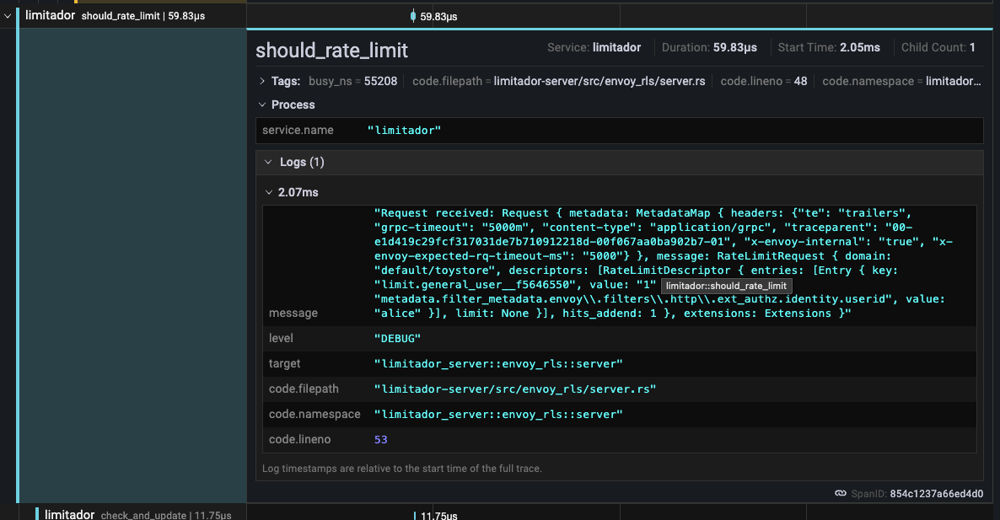

# Enabling tracing with a central collector

## Introduction

This guide outlines the steps to enable tracing in Istio and Kuadrant components (Authorino, Limitador, and WASM), directing traces to a central collector for improved observability and troubleshooting. We'll also explore a typical troubleshooting flow using traces and logs.

## Prerequisites

- A Kubernetes cluster with Istio and Kuadrant installed.
- A trace collector (e.g., Jaeger or Tempo) configured to support [OpenTelemetry](https://opentelemetry.io/) (OTel).

## Configuration Steps

### Istio Tracing Configuration

Enable tracing in Istio by using the [Telemetry API](https://istio.io/v1.20/docs/tasks/observability/distributed-tracing/telemetry-api/).
Depending on your method for installing Istio, you will need to configure a tracing `extensionProvider` in your MeshConfig, Istio or IstioOperator resource as well.
Here is an example Telemetry and Istio config to sample 100% of requests, if using the Istio Sail Operator.

```yaml
apiVersion: telemetry.istio.io/v1alpha1
kind: Telemetry
metadata:
  name: mesh-default
  namespace: gateway-system
spec:
  tracing:
  - providers:
    - name: tempo-otlp
    randomSamplingPercentage: 100
---
apiVersion: operator.istio.io/v1alpha1
kind: Istio
metadata:
  name: default
spec:
  namespace: gateway-system
  values:
    meshConfig:
      defaultConfig:
        tracing: {}
      enableTracing: true
      extensionProviders:
      - name: tempo-otlp
        opentelemetry:
          port: 4317
          service: tempo.tempo.svc.cluster.local
```

**Important:**

The OpenTelemetry collector protocol should be explicitly set in the service port `name` or `appProtocol` fields as per the [Istio documentation](https://istio.io/latest/docs/ops/configuration/traffic-management/protocol-selection/#explicit-protocol-selection). For example, when using gRPC, the port `name` should begin with `grpc-` or the `appProtocol` should be `grpc`.

### Kuadrant Tracing Configuration

Kuadrant components (Authorino, Limitador, and WASM) have request tracing capabilities.
The recommended approach is to configure tracing centrally via the Kuadrant CR, which will automatically propagate the configuration to all components.
Ensure the collector is the same one that Istio is sending traces so that they can be correlated later.

#### Centralized Configuration (Recommended)

Configure tracing once in the Kuadrant CR:

```yaml
apiVersion: kuadrant.io/v1beta1
kind: Kuadrant
metadata:
  name: kuadrant
  namespace: kuadrant-system
spec:
  observability:
    tracing:
      defaultEndpoint: grpc://tempo.tempo.svc.cluster.local:4317
      insecure: true
```

**Configuration Fields:**
- `defaultEndpoint`: The URL of the tracing collector backend. Supported protocols include `grpc://` and `http://`.
- `insecure`: Set to `true` to skip TLS certificate verification (useful for development environments).

This configuration will be automatically propagated to:
- **Authorino** (Auth service)
- **Limitador** (Rate limiting service)
- **WASM** modules (Envoy WebAssembly filters)

Once applied, the Authorino and Limitador components will be redeployed with tracing enabled.

#### Direct Configuration (Advanced)

For advanced use cases, you can configure tracing directly in the Authorino or Limitador CRs:

```yaml
apiVersion: operator.authorino.kuadrant.io/v1beta1
kind: Authorino
metadata:
  name: authorino
spec:
  tracing:
    endpoint: grpc://authorino-collector:4317
    insecure: true
---
apiVersion: limitador.kuadrant.io/v1alpha1
kind: Limitador
metadata:
  name: limitador
spec:
  tracing:
    endpoint: grpc://limitador-collector:4317
```

**Important:** When tracing is configured directly in Authorino or Limitador CRs, those settings take precedence over the Kuadrant CR configuration. The Kuadrant operator will cede ownership of the tracing field to you, allowing full control over component-specific tracing endpoints. This is useful when you need different collectors for different components.

#### Configuration Precedence

The tracing configuration follows this precedence order:

1. **Component-specific configuration** (Authorino/Limitador CR) - highest priority
2. **Centralized configuration** (Kuadrant CR) - applies when component CRs don't specify tracing

If you set tracing in the Kuadrant CR and later configure it directly in an Authorino or Limitador CR, the component-specific configuration will take precedence, and the Kuadrant operator will no longer manage that component's tracing settings.

**Note on Trace Continuity:**

Currently, trace IDs [do not propagate](https://github.com/envoyproxy/envoy/issues/22028) to WebAssembly modules in Istio/Envoy. This affects trace continuity when rate limiting is enforced via WASM filters, as requests may not have the relevant 'parent' trace ID in their trace information.

However, if the trace initiation point is outside of Envoy/Istio, the 'parent' trace ID will be available and included in traces passed to the collector. This limitation can impact correlating traces across the gateway, auth service, rate limiting, and other components in the request path.

Despite this, Kuadrant configures tracing for WASM modules when using the centralized configuration, ensuring that trace data is collected even if parent-child relationships may be limited in some scenarios.

## Control Plane Tracing

The Kuadrant operator itself (the control plane) can export traces to an OpenTelemetry collector. This allows you to trace the operator's reconciliation loops and internal operations, which is useful for debugging controller behavior, understanding operator performance, and tracking policy lifecycle events.

### What Control Plane Traces Show

Control plane traces capture operator activities such as:

- **Policy reconciliation**: When a policy (AuthPolicy, RateLimitPolicy, DNSPolicy, TLSPolicy) is created, updated, or deleted
- **Resource creation**: Creating Authorino AuthConfigs, Limitador configurations, Envoy WASM filters, etc.
- **Gateway topology discovery**: Analyzing Gateway API resources and computing policy attachments
- **Status updates**: Updating policy status conditions
- **Conflict detection**: Detecting and resolving policy conflicts
- **Error handling**: Tracking reconciliation errors and retries

These traces are separate from data plane traces (actual user requests) and help operators understand what the Kuadrant operator is doing behind the scenes.

### Configuration

Control plane tracing is configured via environment variables in the operator deployment:

```yaml
apiVersion: apps/v1
kind: Deployment
metadata:
  name: kuadrant-operator-controller-manager
  namespace: kuadrant-system
spec:
  template:
    spec:
      containers:
      - name: manager
        env:
        - name: OTEL_ENABLED
          value: "true"
        - name: OTEL_EXPORTER_OTLP_ENDPOINT
          value: "jaeger.jaeger.svc.cluster.local:4318"
        - name: OTEL_EXPORTER_OTLP_INSECURE
          value: "true"  # Set to "false" for production with TLS
        - name: OTEL_SERVICE_NAME
          value: "kuadrant-operator"
```

You can apply this configuration by patching the deployment:

```bash
kubectl set env deployment/kuadrant-operator-controller-manager \
  -n kuadrant-system \
  OTEL_ENABLED=true \
  OTEL_EXPORTER_OTLP_ENDPOINT=jaeger.jaeger.svc.cluster.local:4318 \
  OTEL_EXPORTER_OTLP_INSECURE=true \
  OTEL_SERVICE_NAME=kuadrant-operator
```

### Environment Variables

| Variable | Required | Default | Description |
|----------|----------|---------|-------------|
| `OTEL_ENABLED` | No | `false` | Enable OpenTelemetry (logs, traces, metrics) |
| `OTEL_EXPORTER_OTLP_ENDPOINT` | Yes* | `localhost:4318` | OTLP collector endpoint (HTTP) for all signals |
| `OTEL_EXPORTER_OTLP_TRACES_ENDPOINT` | No | - | Override endpoint specifically for traces |
| `OTEL_EXPORTER_OTLP_INSECURE` | No | `true` | Disable TLS for OTLP export (for local dev) |
| `OTEL_SERVICE_NAME` | No | `kuadrant-operator` | Service name shown in tracing UI |
| `OTEL_SERVICE_VERSION` | No | Build version | Service version (defaults to version from ldflags) |
| `OTEL_METRICS_INTERVAL_SECONDS` | No | `15` | Metrics export interval in seconds |

\* Required when `OTEL_ENABLED=true`

### Viewing Control Plane Traces

Once control plane tracing is enabled, you can view operator traces in Jaeger or Grafana:

**Using Jaeger UI:**

1. Port-forward to Jaeger:
   ```bash
   kubectl port-forward -n jaeger svc/jaeger 16686:16686
   ```

2. Open http://localhost:16686

3. Select service: **kuadrant-operator**

4. Search for traces by:
   - **Operation name**: Look for operations like `RateLimitPolicyReconciler.Reconcile`, `AuthPolicyReconciler.Reconcile`
   - **Tags**: Filter by resource name, namespace, or policy type
   - **Duration**: Find slow reconciliations

**Example Trace Spans:**

A typical policy creation generates traces like:

```
kuadrant-operator
└─ RateLimitPolicyReconciler.Reconcile (5.2s)
   ├─ Fetch RateLimitPolicy (12ms)
   ├─ Compute Topology (45ms)
   ├─ Reconcile Limitador Config (2.1s)
   │  ├─ Generate Limitador Limits (15ms)
   │  └─ Update Limitador CR (2.0s)
   ├─ Reconcile WASM Plugin (1.8s)
   │  ├─ Build WASM Config (120ms)
   │  └─ Apply WasmPlugin (1.6s)
   └─ Update Policy Status (1.2s)
```

### Tracing Policy Lifecycle

To trace a specific policy creation:

1. **Create a policy**:
   ```bash
   kubectl apply -f my-ratelimitpolicy.yaml
   ```

2. **Get the policy creation timestamp**:
   ```bash
   kubectl get ratelimitpolicy my-policy -o jsonpath='{.metadata.creationTimestamp}'
   ```

3. **Search in Jaeger**:
   - Set the time range around the creation timestamp
   - Look for operation: `RateLimitPolicyReconciler.Reconcile`
   - Filter by tags like `policy.name=my-policy`

### Correlating Control Plane and Data Plane Traces

While control plane and data plane traces are separate, you can correlate them:

1. **Control plane trace**: Shows when a policy was reconciled and resources created
2. **Data plane trace**: Shows actual user requests processed with that policy

Example workflow:
1. Create a RateLimitPolicy at `15:30:00`
2. View control plane trace to see:
   - Policy reconciliation completed at `15:30:05`
   - Limitador configuration updated
   - WASM plugin deployed
3. Send a test request at `15:30:10`
4. View data plane trace to see:
   - Request processed through WASM filter
   - Rate limit check sent to Limitador
   - Response returned

### Local Development

For local development, you can run the operator with control plane tracing enabled:

```bash
# Start Jaeger or an OTel collector
docker compose -f examples/otel/docker-compose.yaml up -d

# Run the operator with OpenTelemetry enabled
export OTEL_ENABLED=true
export OTEL_EXPORTER_OTLP_ENDPOINT=localhost:4318
make run

# View traces in Jaeger (http://localhost:16686)
```

See the [OpenTelemetry example](../../examples/otel/README.md) for complete local development setup with Grafana, Tempo, Jaeger, Loki, and Prometheus.

### Troubleshooting Control Plane Tracing

**Traces not appearing in Jaeger:**

1. Check operator logs for OTLP errors:
   ```bash
   kubectl logs -n kuadrant-system -l control-plane=controller-manager --tail=50 | grep -i otel
   ```

2. Verify OTLP endpoint is reachable:
   ```bash
   kubectl exec -n kuadrant-system deployment/kuadrant-operator-controller-manager -- \
     curl -v http://jaeger.jaeger.svc.cluster.local:4318/v1/traces
   ```

3. Check environment variables are set:
   ```bash
   kubectl get deployment -n kuadrant-system kuadrant-operator-controller-manager \
     -o jsonpath='{.spec.template.spec.containers[0].env[?(@.name=="OTEL_ENABLED")]}'
   ```

**Traces are incomplete or missing spans:**

- Ensure all reconciler functions properly propagate the context
- Check for errors in the operator logs
- Verify the OTLP collector is not dropping spans due to rate limiting

## Troubleshooting Flow Using Traces and Logs

Using a tracing interface like the Jaeger UI or Grafana, you can search for trace information by the trace ID.
You may get the trace ID from logs, or from a header in a sample request you want to troubleshoot.
You can also search for recent traces, filtering by the service you want to focus on.

Here is an example trace in the Grafana UI showing the total request time from the gateway (Istio), the time to check the curent rate limit count (and update it) in limitador and the time to check auth in Authorino:


In limitador, it is possible to enable request logging with trace IDs to get more information on requests.
This requires the log level to be increased to at least debug, so the verbosity must be set to 3 or higher in the Limitador CR. For example:

```yaml
apiVersion: limitador.kuadrant.io/v1alpha1
kind: Limitador
metadata:
  name: limitador
spec:
  verbosity: 3
```

A log entry will look something like this, with the `traceparent` field holding the trace ID:

```
"Request received: Request { metadata: MetadataMap { headers: {"te": "trailers", "grpc-timeout": "5000m", "content-type": "application/grpc", "traceparent": "00-4a2a933a23df267aed612f4694b32141-00f067aa0ba902b7-01", "x-envoy-internal": "true", "x-envoy-expected-rq-timeout-ms": "5000"} }, message: RateLimitRequest { domain: "default/toystore", descriptors: [RateLimitDescriptor { entries: [Entry { key: "limit.general_user__f5646550", value: "1" }, Entry { key: "metadata.filter_metadata.envoy\\.filters\\.http\\.ext_authz.identity.userid", value: "alice" }], limit: None }], hits_addend: 1 }, extensions: Extensions }"
```

If you centrally aggregate logs using something like promtail and loki, you can jump between trace information and the relevant logs for that service:



Using a combination of tracing and logs, you can visualise and troubleshoot request timing issues and drill down to specific services.
This method becomes even more powerful when combined with [metrics](https://docs.kuadrant.io/latest/kuadrant-operator/doc/observability/metrics/), [access logs](./envoy-access-logs.md), and [dashboards](https://docs.kuadrant.io/latest/kuadrant-operator/doc/observability/examples/) to get a more complete picture of your users traffic.
