# Helm Charts Overview

This document describes both the development workflow and production release process for Kuadrant Operator Helm charts, from local development to [Artifact Hub](https://artifacthub.io/packages/helm/kuadrant/kuadrant-operator) publication.

## 1. Development Process

### Overview

During development, developers can build, test, and validate helm chart changes locally before submitting PRs. The development process focuses on iterating on chart templates, testing changes.

### Development Workflow

```mermaid
sequenceDiagram
    participant Dev as 👨‍💻 Developer  
    participant Local as 💻 Local Environment
    participant GitHub as 📦 GitHub PR
    participant CI as 🔄 CI/CD

    Note over Dev, CI: 🔧 Local Development
    Dev->>Local: Edit chart files in charts/kuadrant-operator/
    Dev->>Local: Run make helm-build
    Local->>Local: • Set WASM shim image<br/>• Set operator image<br/>• Generate templates from kustomize<br/>• Update Chart.yaml versions
    
    Note over Dev, CI: ✅ Testing & Validation  
    Dev->>Local: Run helm lint charts/kuadrant-operator
    Dev->>Local: Run helm template for testing
    Dev->>Local: Run make verify-helm-charts
    Local->>Local: Validate chart structure and syntax
    
    Note over Dev, CI: 📤 Submit Changes
    Dev->>GitHub: Create PR with chart changes
    GitHub->>CI: Trigger automated validation
    CI->>CI: Run make verify-helm-charts
    CI->>CI: Lint charts and test rendering
    CI->>GitHub: Report validation results
```



### Key Development Commands

| Command | Purpose | Description |
|-------|---------|-------------|
| `make helm-build` | Build Charts | Generates templates from kustomize and updates Chart.yaml versions |
| `make verify-helm-charts` | Validate | Runs linting, validation, and checks for chart updates |
| `make helm-package` | Package | Creates .tgz file for local testing |
| `make helm-dependency-build` | Dependencies | Downloads chart dependencies |

### Chart Structure

The Kuadrant Operator helm chart is located in `charts/kuadrant-operator/` and includes:

- **Chart.yaml**: Contains metadata, dependencies, and Artifact Hub annotations
- **templates/**: Generated from kustomize manifests via `make helm-build`
- **values.yaml**: Default configuration values
- **charts/**: Dependencies (authorino-operator, limitador-operator, dns-operator)

### Development Workflow Steps

1. **Edit Chart Files**: To add/update resources installed through Helm, modify the templates, values, or Chart.yaml in `charts/kuadrant-operator/` as needed.
2. **Build Charts**: Run `make helm-build` to generate updated templates  
3. **Lint Changes**: Use `helm lint charts/kuadrant-operator` to check for issues in the chart structure
4. **Test Template Rendering**: Use `helm template kuadrant-operator charts/kuadrant-operator` to verify that templates render correctly.
5. **Verify Changes**: Run `make verify-helm-charts` to ensure no regressions
6. **Package Chart**: Use `make helm-package` to create a `.tgz` package for local testing
7. **Install Helm Chart**: Test installation with `helm install kuadrant-operator charts/kuadrant-operator`
6. **Submit PR**: Create pull request with chart changes for review
7. **CI Validation**: Automated checks validate chart quality and compatibility

## 2. Release Process

### Overview

The production release process is fully automated and consists of five main phases that take chart changes from development through to public availability on Artifact Hub.

**Release Phases:**
1. **Release Preparation** - Developer triggers release workflow and prepares manifests
2. **Release Creation** - Creates GitHub release with git tag
3. **Helm Chart Publishing** - Packages, signs, and uploads chart to GitHub release assets
4. **Helm Charts Repository Processing** - Syncs chart to dedicated helm-charts repository
5. **Artifact Hub Publishing** - Charts become available on Artifact Hub automatically

### Release Process Flow

```mermaid
sequenceDiagram
    participant Dev as 👨‍💻 Developer
    participant GHA as 🔄 GitHub Actions
    participant GitHub as 📦 GitHub
    participant CreatePR as 📝 create-pull-request
    participant HelmWF as ⚙️ Helm Workflow
    participant ChartRepo as 📊 helm-charts Repo
    participant SyncChart as 🔄 sync-chart-created
    participant SyncIndex as 📋 sync-index
    participant ArtifactHub as 🎯 Artifact Hub

    Note over Dev, ArtifactHub: 🔧 Phase 1: Release Preparation
    Dev->>GHA: Trigger Automated Release Workflow
    GHA->>GHA: Update release.yaml with versions
    GHA->>GHA: Run make prepare-release<br/>• Execute make_chart.sh script<br/>• Build helm templates<br/>• Update Chart.yaml with versions
    GHA->>GitHub: Create release-v{MAJOR.MINOR} base branch<br/>(if it doesn't exist)
    GHA->>CreatePR: Invoke create-pull-request
    CreatePR->>GitHub: Auto-create release-v{FULL_VERSION} branch
    CreatePR->>GitHub: Commit chart changes to working branch
    CreatePR->>GitHub: Create PR (working → base branch)

    Note over Dev, ArtifactHub: 🏷️ Phase 2: Release Creation
    Dev->>GitHub: Review and merge release PR
    GitHub->>GitHub: Create git tag (e.g. v1.0.0)
    GitHub->>GitHub: Create GitHub Release with changelog

    Note over Dev, ArtifactHub: ⚙️ Phase 3: Helm Chart Publishing
    GitHub->>HelmWF: Release Published Event triggers workflow
    HelmWF->>HelmWF: Configure GPG key for signing
    HelmWF->>HelmWF: Build chart dependencies<br/>(make helm-dependency-build)
    HelmWF->>HelmWF: Package & sign pre-built chart<br/>(make helm-package-sign)
    HelmWF->>GitHub: Upload chart assets<br/>(.tgz + .prov signature files)
    HelmWF->>ChartRepo: GitHub API repository_dispatch<br/>event_type: "chart-created"

    Note over Dev, ArtifactHub: 🔄 Phase 4: Helm Charts Repository Processing
    ChartRepo->>SyncChart: Trigger sync-chart-created.yaml workflow
    SyncChart->>GitHub: Download chart from release asset URL
    SyncChart->>SyncChart: Update charts/index.yaml<br/>Add new chart version
    SyncChart->>ChartRepo: Commit updated index to main branch
    ChartRepo->>SyncIndex: Trigger sync-index.yaml workflow<br/>(on charts/index.yaml change)
    SyncIndex->>SyncIndex: Copy index.yaml to gh-pages branch
    SyncIndex->>ChartRepo: Publish to kuadrant.io/helm-charts

    Note over Dev, ArtifactHub: 🎯 Phase 5: Artifact Hub Publishing
    ChartRepo->>ArtifactHub: Updated helm repository detected
    ArtifactHub->>ArtifactHub: Auto-discovery scan of repository
    ArtifactHub->>ArtifactHub: Chart available at artifacthub.io
```



### Detailed Release Process

#### Phase 1: Release Preparation

**Trigger**: Developer manually runs the [Automated Release Workflow](../../.github/workflows/automated-release.yaml) or follows the process manually as outlined in [RELEASE.md](../../RELEASE.md)

**Workflow**: [automated-release.yaml](../../.github/workflows/automated-release.yaml)

**Automated Steps**:
1. **Updates Versions**: The workflow updates the `release.yaml` file with all component versions:
    - Kuadrant Operator version
    - Authorino Operator version
    - Limitador Operator version
    - DNS Operator version
    - WASM Shim version
    - Console Plugin version

2. **Runs Prepare Release**: Executes `make prepare-release` which:
    - Runs the [release script](../../utils/release/release.sh) in phases:
        - `pre-validation` - Validates all dependencies are available
        - `dependencies` - Processes and validates dependency versions
        - `operator` - Builds operator manifests and helm charts
        - `post-validation` - Final validations
    - **Builds Helm Charts** via `make_chart.sh` [script](../../utils/release/operator/make_chart.sh) which:
        - Sets the desired WASM shim image in manager deployment
        - Sets the operator image reference
        - Builds helm chart templates from kustomize manifests (`kustomize build config/helm`)
        - Updates Chart.yaml with version and dependency versions

3. **Creates Pull Request**:
    - Creates base branch `release-v{MAJOR.MINOR}` (e.g., `release-v1.0`) if it doesn't exist
    - Uses `peter-evans/create-pull-request` action which automatically:
      - Creates working branch `release-v{FULL_VERSION}` (e.g., `release-v1.0.0`)
      - Commits all changes from `make prepare-release`
      - Opens PR from working branch to base branch

#### Phase 2: Release Creation

**Overview**: Once the release PR is merged the release creation will be triggered.

**Trigger**: Release PR is merged (from `release-v{FULL_VERSION}` to `release-v{MAJOR.MINOR}` branch)

**Workflow**: [release-operator.yaml](../../.github/workflows/release-operator.yaml)

**Automated Steps**:
1. Creates a git tag (e.g., `v1.0.0`)
2. Generates release changelog
3. Creates a GitHub release with the tag

**Manual Alternative**: See the [Release Process Documentation](../../RELEASE.md) for detailed manual release steps including validation procedures and troubleshooting.

#### Phase 3: Helm Chart Publishing

**Trigger**: GitHub release is published (triggers `release.published` event)

**Workflow**: [release-helm-chart.yaml](../../.github/workflows/release-helm-chart.yaml)

**Automated Steps**:
1. **Configures GPG Key**: Sets up GPG key for chart signing
2. **Builds Dependencies**:
   ```bash
   make helm-add-kuadrant-repo
   make helm-dependency-build
   ```
3. **Packages & Signs Chart**:
   ```bash
   GPG_KEY_UID="Kuadrant Development Team" make helm-package-sign
   ```
   *(Note: Chart templates were already built during Phase 1's `make_chart.sh` script)*
4. **Uploads to GitHub Release**:
    - Uploads the packaged chart (`.tgz` file) as a release asset
    - Uploads the provenance file (`.tgz.prov`) for security verification
5. **Syncs to Helm Charts Repo**: Executes `helm-sync-package-created`

#### Phase 4: Helm Charts Repository Processing

**Trigger**: API call from the main operator repository

**Workflows**:
- [sync-chart-created.yaml](https://github.com/Kuadrant/helm-charts/blob/main/.github/workflows/sync-chart-created.yaml) - handles `repository_dispatch` events
- [sync-index.yaml](https://github.com/Kuadrant/helm-charts/blob/main/.github/workflows/sync-index.yaml) - syncs updated index to gh-pages

**Mechanism**: The `helm-sync-package-created` target makes a GitHub API call:

```bash
curl -L \
  -X POST \
  -H "Accept: application/vnd.github+json" \
  -H "Authorization: Bearer $(HELM_WORKFLOWS_TOKEN)" \
  -H "X-GitHub-Api-Version: 2022-11-28" \
  https://api.github.com/repos/$(ORG)/helm-charts/dispatches \
  -d '{"event_type":"chart-created","client_payload":{"chart":"$(CHART_NAME)","version":"$(CHART_VERSION)", "browser_download_url": "$(BROWSER_DOWNLOAD_URL)"}}'
```

**Process**:
1. **Chart Processing**: The `sync-chart-created.yaml` workflow handles the `repository_dispatch` event, downloads the chart, and updates the repository index
2. **Index Sync**: When `charts/index.yaml` is updated, the `sync-index.yaml` workflow automatically syncs it to the `gh-pages` branch
3. **Publication**: The updated index is served at `https://kuadrant.io/helm-charts/`

#### Phase 5: Artifact Hub Publishing

**Trigger**: Updates to the helm repository at `https://kuadrant.io/helm-charts/`

**Workflows**: No specific workflows required - handled by Artifact Hub's automatic discovery

**Mechanism**: [Artifact Hub automatically discovers](https://artifacthub.io/docs/topics/repositories/helm-charts/) and syncs helm charts from registered repositories.

The chart becomes available at: https://artifacthub.io/packages/helm/kuadrant/kuadrant-operator

## Chart Dependencies

The chart depends on three operator charts, all published to the same helm repository:
- `authorino-operator` - Authentication and authorization
- `limitador-operator` - Rate limiting
- `dns-operator` - DNS management

## Security Features

- **GPG Signing**: All charts are signed with GPG key `8A2150B44E1994E1E91ED9E5E19171BE516B79C7`
- **Provenance Files**: `.prov` files provide cryptographic verification
- **Public Key**: Available at https://kuadrant.io/helm-charts/kuadrant-public-key.asc

## Prerequisites

For the publishing process to work, the following must be configured:

1. **GitHub Secrets**:
    - `HELM_CHARTS_SIGNING_KEY`: GPG private key for chart signing
    - `HELM_WORKFLOWS_TOKEN`: GitHub token with access to helm-charts repository
    - `KUADRANT_DEV_PAT`: Personal access token for creating releases
   *Note*: These secrets are stored as GH action variables in the Kuadrant organization. If testing these workflows locally, you can set them in your local environment or use a `.env` file.

2. **Dependencies Released**: All dependent operators must be released before Kuadrant Operator:
    - Authorino Operator
    - Limitador Operator
    - DNS Operator
    - WASM Shim

3. **Repository Access**: Write access to the [helm-charts repository](https://github.com/Kuadrant/helm-charts)

## Troubleshooting

### Common Issues

1. **Missing Dependencies**: Ensure all dependent operator versions exist before releasing
2. **GPG Key Issues**: Verify the signing key is properly configured in secrets
3. **Token Permissions**: Ensure `HELM_WORKFLOWS_TOKEN` has sufficient permissions
4. **Helm Chart Validation**: Run `make verify-helm-charts` locally before releasing

### Manual Intervention

If the automated process fails, you can manually trigger parts of the workflow:

1. **Rebuild Charts**: Run `make helm-build` locally
2. **Manual Package**: Use `make helm-package-sign` to create signed charts
3. **Trigger Sync**: Use the `workflow_dispatch` trigger on release-helm-chart.yaml

### Verification

To verify a successful release:

1. Check the GitHub release has chart assets (`.tgz` and `.tgz.prov` files)
2. Verify the chart appears in https://kuadrant.io/helm-charts/
3. Confirm the chart is listed on [Artifact Hub](https://artifacthub.io/packages/helm/kuadrant/kuadrant-operator)
4. Test installation: `helm install kuadrant-operator kuadrant/kuadrant-operator`

## Related Files

- [`Makefile`](../../Makefile) - Main release target
- [`make/helm.mk`](../../make/helm.mk) - Helm-specific targets
- [`utils/release/release.sh`](../../utils/release/release.sh) - Release script
- [`charts/kuadrant-operator/Chart.yaml`](../../charts/kuadrant-operator/Chart.yaml) - Chart metadata
- [`.github/workflows/automated-release.yaml`](../../.github/workflows/automated-release.yaml) - Release automation
- [`.github/workflows/release-operator.yaml`](../../.github/workflows/release-operator.yaml) - Release creation
- [`.github/workflows/release-helm-chart.yaml`](../../.github/workflows/release-helm-chart.yaml) - Chart publishing

## References

- [Kuadrant Helm Charts Repository](https://github.com/Kuadrant/helm-charts)
- [Artifact Hub Documentation](https://artifacthub.io/docs/topics/repositories/helm-charts/)
- [Helm Chart Best Practices](https://helm.sh/docs/chart_best_practices/)
- [Release Process Documentation](../../RELEASE.md)
