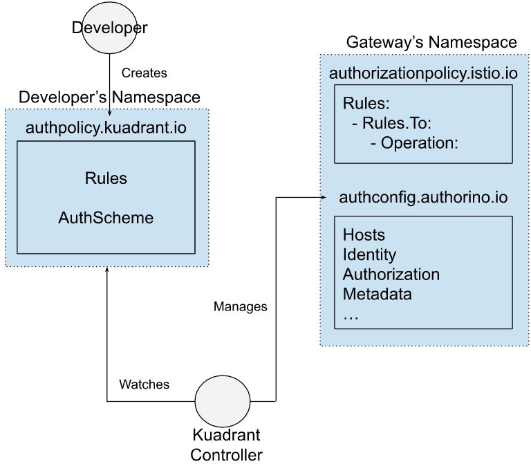

# AuthPolicy Proposal
Authors: Rahul Anand (rahanand@redhat.com), Craig Brookes (cbrookes@redhat.com)

## Introduction
Istio offers an [AuthorizationPolicy](https://istio.io/latest/docs/reference/config/security/authorization-policy/) resource which requires it to be applied in the namespace of the workload. This means that all the configuration is completely decoupled from routing logic like hostnames and paths. For managed gateway scenario, users need to either ask cluster operator to apply their policies in the gateway's namespace (which is not scalable) or use sidecars/personal gateway for their workloads in their own namepsace which is not optimal.

The new [GatewayAPI](https://gateway-api.sigs.k8s.io/) defines a standard [policy attachment mechanism](https://gateway-api.sigs.k8s.io/v1alpha2/references/policy-attachment/) for hierarchical effect of vendor specific policies. We believe creating a new CRD with concepts from Gateway API that solves use cases of Istio's AuthorizationPolicy plus its limitations as described above.

## Goals

With `targetRef`  from policy attachment concept, following are the goals:
- Application developer should be able target [`HTTPRoute`](https://gateway-api.sigs.k8s.io/v1alpha2/references/spec/#gateway.networking.k8s.io/v1alpha2.HTTPRoute) object in their own namespace. This will define authorization policy at the hostname/domain/vHost level.
- Cluster operator should be able to target [`Gateway`](https://gateway-api.sigs.k8s.io/v1alpha2/references/spec/#gateway.networking.k8s.io/v1alpha2.Gateway) object along with HTTPRoute in the gateway's namespace. This will define policy at the <ins>listener</ins> level.
- To reduce context sharing at the gateway and external authorization provider, action type and auth-provider are defaulted to `CUSTOM` and authorino respectively.

## Proposed Solution
Following is the proposed new CRD that combines policy attachment concepts with Istio's AuthorizationPolicy:

```yaml=
apiVersion: apim.kuadrant.io/v1alpha1
kind: AuthPolicy
metadata:
  name: toystore
spec:
  targetRef:
    group: # Only takes gateway.networking.k8s.io
    kind: HTTPRoute | Gateway
    name: toystore
  rules:
      - hosts: ["*.toystore.com"]
        methods: ["GET", "POST"]
        paths: ["/admin"]
  authSchemes: # Embedded AuthConfigs
    - hosts: ["admin.toystore.com"]
      identity:
      - name: idp-users
        oidc:
          endpoint: https://my-idp.com/auth/realm
      authorization:
      - name: check-claim
        json:
          rules:
          - selector: auth.identity.group
            operator: eq
            value: allowed-users
status:
  conditions:
    - lastTransitionTime: "2022-06-06T11:03:04Z"
      message: HTTPRoute/Gateway is protected/Error
      reason: HTTPRouteProtected/GatewayProtected/Error
      status: "True" | "False"
      type: Available
    observedGeneration: 1
```

### Target Reference
`targetRef` field is taken from [policy attachment's target reference API](https://gateway-api.sigs.k8s.io/v1alpha2/references/policy-attachment/#target-reference-api). It can only target one resource at a time. Fields included inside:
- `Group` is the group of the target resource. Only valid option is `gateway.networking.k8s.io`.
- `Kind` is kind of the target resource. Only valid options are `HTTPRoute` and `Gateway`.
- `Name` is the name of the target resource.
- `Namespace` is the namespace of the referent. Currently only local objects can be referred so value is ignored.

### Rule objects
`rules` field describe the requests that will be routed to external authorization provider (like authorino). It includes:
- `hosts`: a host is matched over `Host` request header or `SNI` if TLS is used.
 
**Note**: Each rule's host in a route level policy must match at least one hostname regex described in [HTTPRoute's `hostnames`](https://gateway-api.sigs.k8s.io/v1alpha2/references/spec/#gateway.networking.k8s.io/v1alpha2.Hostname) but Gateway level policies have no such restriction.
```
                            targetRef
       HTTPRoute  ◄─────────────────────────  AuthPolicy
  hostnames: ["*.toystore.com"]             rules:
                                           ┌────────────────────────────┐
                            Rejected Rule: │- hosts: ["*.carstore.com"] │
                            Regex mismatch │  methods: ["GET", "DELETE"]│
                                           └────────────────────────────┘

                                           ┌───────────────────────────────┐
                            Accepted Rule: │- hosts: ["admin.toystore.com"]│
                            Regex match    │  methods: ["POST", "DELETE"]  │
                                           └───────────────────────────────┘
```

- `paths`: a path matches over request path like `/admin/`.
- `methods`: a method matches over request method like `DELETE`.

Fields in a rule object are ANDed together but inner fields follow OR semantics. For example,
```
hosts: ["*.toystore.com"]
methods: ["GET", "POST"]
paths: ["/admin"]
```
The above rule matches if the host matches`*.toystore.com` AND the method is `POST` OR `GET`; AND path is `/admin`

Internally, All the rules in a AuthPolicy are translated into list of [`Operations`](https://istio.io/latest/docs/reference/config/security/authorization-policy/#Operation) under a single [Istio's AuthorizationPolicy](https://istio.io/latest/docs/reference/config/security/authorization-policy/) with CUSTOM [action](https://istio.io/latest/docs/reference/config/security/authorization-policy/#AuthorizationPolicy-Action) type and [external authorization provider](https://istio.io/latest/docs/reference/config/security/authorization-policy/#AuthorizationPolicy-ExtensionProvider) as authorino.

### AuthScheme object
AuthScheme is embedded form of [Authorino's AuthConfig](https://github.com/Kuadrant/authorino/blob/main/docs/architecture.md#the-authorino-authconfig-custom-resource-definition-crd). Applying an AuthPolicy resource with at least one AuthScheme would create same number of AuthConfigs in the <ins>Gateway's namespace</ins>.

**Note**: Following the heirarchial constraints, `spec.AuthSchemes.Hosts` must match at least one `spec.Hosts` for AuthPolicy to be validated.

The example AuthPolicy showed above will create the following AuthConfig:

```yaml=
apiVersion: authorino.kuadrant.io/v1beta1
kind: AuthConfig
metadata:
  name: default-toystore-1
spec:
  hosts:
  - "admin.toystore.com"
  identity:
    - name: idp-users
      oidc:
        endpoint: https://my-idp.com/auth/realm
  authorization:
    - name: check-claim
      json:
        rules:
          - selector: auth.identity.group
            operator: eq
            value: allowed-users
```

Overall control structure looks like the following between the developer and the kuadrant controller:


## Checklist
- Issue tracking this proposal: https://github.com/Kuadrant/kuadrant-controller/issues/130
