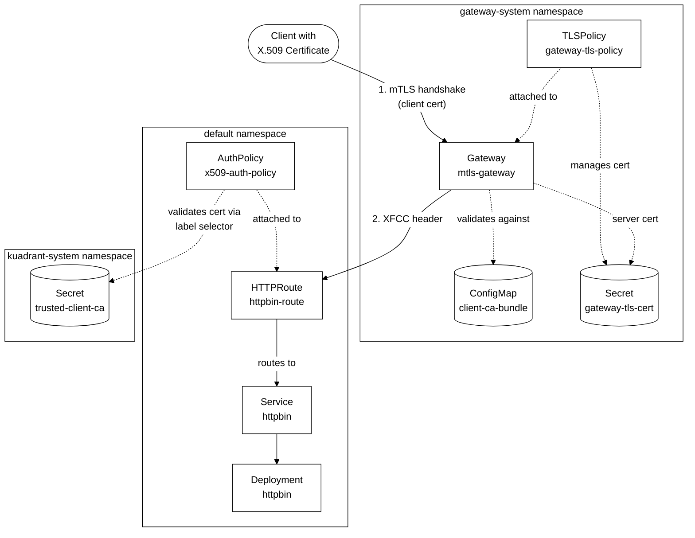

# X.509 Client Certificate Authentication

This guide demonstrates X.509 client certificate authentication using Gateway API v1.5+ with frontend TLS validation ([RFC 0015](https://github.com/Kuadrant/architecture/blob/main/rfcs/0015-x509-client-cert-authpolicy.md) / Tier 1).

## Overview

Tier 1 of [RFC 0015](https://github.com/Kuadrant/architecture/blob/main/rfcs/0015-x509-client-cert-authpolicy.md) implements defense-in-depth security with two validation layers:

1. **Layer 1 (TLS/L4)**: Gateway validates client certificates during the TLS handshake
2. **Layer 2 (Application/L7)**: Authorino validates certificates using label selectors for multi-CA trust

### Request Flow

1. Client initiates HTTPS connection with client certificate
2. Gateway validates certificate against `caCertificateRefs` during TLS handshake
3. Invalid/expired/untrusted certificates are rejected at the TLS layer
4. For valid certificates, gateway terminates TLS and populates the `x-forwarded-client-cert` (XFCC) header
5. Wasm-shim forwards XFCC header to Authorino in CheckRequest
6. Authorino extracts and validates the certificate from the XFCC header
7. Authorino applies fine-grained validation using label selectors on CA Secrets
8. Request proceeds only if both layers succeed

## Prerequisites

- Kubernetes 1.31+ (required for Gateway API v1.5 CEL validation rules in CRDs)
- Gateway API v1.5+ with `spec.tls.frontend.default.validation` support
- Istio v1.27+ or compatible Gateway implementation supporting XFCC header forwarding
  - For local testing with `make local-setup`, use `ISTIO_INSTALL_SAIL=false` to install upstream Istio
- Kuadrant Operator installed
- Kuadrant instance deployed

## Setup

### Step 1: Generate Test Certificates

For testing purposes, generate self-signed certificates:

```sh
# Generate CA private key and certificate
openssl req -x509 -sha512 -nodes \
  -days 365 \
  -newkey rsa:4096 \
  -subj "/CN=Test CA/O=Kuadrant/C=US" \
  -addext basicConstraints=CA:TRUE \
  -addext keyUsage=digitalSignature,keyCertSign \
  -keyout /tmp/ca.key \
  -out /tmp/ca.crt

# Create X.509 v3 extensions file for client certificate
cat > /tmp/x509v3.ext << EOF
authorityKeyIdentifier=keyid,issuer
basicConstraints=CA:FALSE
keyUsage=digitalSignature,nonRepudiation,keyEncipherment,dataEncipherment
extendedKeyUsage=clientAuth
EOF

# Generate client private key and certificate signed by the CA
openssl genrsa -out /tmp/client.key 4096
openssl req -new \
  -subj "/CN=test-client/O=Kuadrant/C=US" \
  -key /tmp/client.key \
  -out /tmp/client.csr
openssl x509 -req -sha512 \
  -days 1 \
  -CA /tmp/ca.crt \
  -CAkey /tmp/ca.key \
  -CAcreateserial \
  -extfile /tmp/x509v3.ext \
  -in /tmp/client.csr \
  -out /tmp/client.crt

# Update the ConfigMap and Secret with the generated CA certificate
kubectl create configmap client-ca-bundle -n gateway-system \
  --from-file=ca.crt=/tmp/ca.crt

kubectl create secret tls trusted-client-ca -n kuadrant-system \
  --cert=/tmp/ca.crt \
  --key=/tmp/ca.key
kubectl label secret trusted-client-ca -n kuadrant-system \
  authorino.kuadrant.io/managed-by=authorino \
  app.kubernetes.io/name=trusted-client
```

> **Note**: For production, use certificates from your PKI infrastructure and consider using cert-manager for automated certificate management.

### Step 2: Deploy Resources

Deploy the example resources:

```sh
kubectl apply -f examples/x509-authentication/
```

This creates:
- **Gateway** (`mtls-gateway`): Gateway with mTLS configured
- **Deployment/Service** (`httpbin`): Test application
- **HTTPRoute** (`httpbin-route`): Routes traffic to the protected service
- **AuthPolicy** (`x509-auth-policy`): X.509 authentication using XFCC header

## Configuration Details

### Topology Overview

The following diagram illustrates the architecture and relationships between components:



**Component Interactions:**

1. **TLS Layer (L4)**: Client presents certificate → Gateway validates against `client-ca-bundle` ConfigMap
2. **Application Layer (L7)**: Gateway forwards XFCC header → AuthPolicy validates against `trusted-client-ca` Secret using label selectors
3. **Routing**: HTTPRoute connects the Gateway listener to the httpbin Service
4. **Policy Attachment**: AuthPolicy attaches to HTTPRoute for fine-grained certificate validation

### Gateway Configuration

The Gateway uses `spec.tls.frontend.default.validation` for client certificate validation:

```yaml
apiVersion: gateway.networking.k8s.io/v1
kind: Gateway
metadata:
  name: mtls-gateway
  namespace: gateway-system
spec:
  gatewayClassName: istio
  listeners:
  - name: https
    protocol: HTTPS
    port: 443
    hostname: "*.nip.io"
    tls:
      mode: Terminate
      certificateRefs:
      - name: gateway-tls-cert
        kind: Secret
  tls:
    frontend:
      default:
        validation:
          caCertificateRefs:
          - name: client-ca-bundle
            kind: ConfigMap
            group: ""
          mode: AllowValidOnly  # Requires valid client certificates
```

**Key fields:**
- `caCertificateRefs`: References ConfigMap(s) containing trusted CA certificates in PEM format
- `mode: AllowValidOnly`: Requires valid certificates; use `AllowInsecureFallback` for optional mTLS

### AuthPolicy Configuration

The AuthPolicy configures X.509 authentication using the XFCC header:

```yaml
apiVersion: kuadrant.io/v1
kind: AuthPolicy
metadata:
  name: x509-auth-policy
  namespace: default
spec:
  targetRef:
    group: gateway.networking.k8s.io
    kind: HTTPRoute
    name: httpbin-route
  rules:

    # Authentication based on client certificate
    authentication:
      "x509-client-cert":
        x509:
          # Extract certificate from XFCC header
          source:
            xfccHeader: "x-forwarded-client-cert"
          # Label selector for trusted CA certificates
          selector:
            matchLabels:
              app.kubernetes.io/name: trusted-client

    # Additional rules to enforce authorization based on certificate attributes
    # and propagate client certificate information into request headers
    authorization:
      "certificate-attributes":
        patternMatching:
          patterns:
          - predicate: "size(auth.identity.Organization) > 0 && auth.identity.Organization[0] == 'Kuadrant'"
    response:
      success:
        headers:
          # Extract the Common Name (CN) from the certificate
          "x-client-cn":
            plain:
              expression: auth.identity.CommonName
          # Extract the Organization (O) from the certificate
          "x-client-org":
            plain:
              expression: auth.identity.Organization[0]
```

**Certificate Source Options:**

The `x509.source` field supports three options:

1. **`xfccHeader`**: Extract from Envoy's X-Forwarded-Client-Cert header
   ```yaml
   source:
     xfccHeader: "x-forwarded-client-cert"
   ```

2. **`clientCertHeader`**: Extract from RFC 9440 Client-Cert header
   ```yaml
   source:
     clientCertHeader: "client-cert"
   ```

3. **`expression`**: Extract using CEL expression for custom attribute paths
   ```yaml
   source:
     expression: 'request.http.headers["x-custom-client-cert"]'
   ```

## Testing

### Test with Valid Certificate

```sh
GATEWAY_IP=$(kubectl get gateway mtls-gateway -n gateway-system -o jsonpath='{.status.addresses[0].value}')

# Make request with client certificate
curl -ik https://httpbin.$GATEWAY_IP.nip.io/get \
  --cert /tmp/client.crt \
  --key /tmp/client.key \
  --cacert /tmp/ca.crt
```

**Expected Result**: Request succeeds (HTTP 200) because both gateway and Authorino validation pass.

### Test without Certificate

```sh
curl -ik https://httpbin.$GATEWAY_IP.nip.io/get \
  --cacert /tmp/ca.crt
```

**Expected Result**: TLS handshake fails. Gateway rejects connection because no client certificate was provided.

### Test with Invalid Certificate

```sh
# Generate a self-signed certificate not trusted by the CA
openssl req -x509 -newkey rsa:2048 -nodes \
  -keyout /tmp/untrusted.key -out /tmp/untrusted.crt -days 365 \
  -subj "/CN=untrusted-client/O=Untrusted/C=US"

# Try to connect with untrusted certificate
curl -ik https://httpbin.$GATEWAY_IP.nip.io/get \
  --cert /tmp/untrusted.crt \
  --key /tmp/untrusted.key \
  --cacert /tmp/ca.crt
```

**Expected Result**: TLS handshake fails. Gateway rejects connection because the certificate is not signed by a trusted CA.

### Test with Unauthorized Certificate

```sh
# Generate a CA-signed certificate with different attributes that do not match the AuthPolicy rules
openssl genrsa -out /tmp/unauthorized-client.key 4096
openssl req -new \
  -subj "/CN=unauthorized-client/O=Unauthorized/C=US" \
  -key /tmp/unauthorized-client.key \
  -out /tmp/unauthorized-client.csr
openssl x509 -req -sha512 \
  -days 1 \
  -CA /tmp/ca.crt \
  -CAkey /tmp/ca.key \
  -CAcreateserial \
  -extfile /tmp/x509v3.ext \
  -in /tmp/unauthorized-client.csr \
  -out /tmp/unauthorized-client.crt

# Try to connect with unauthorized certificate
curl -ik https://httpbin.$GATEWAY_IP.nip.io/get \
  --cert /tmp/unauthorized-client.crt \
  --key /tmp/unauthorized-client.key \
  --cacert /tmp/ca.crt
```

**Expected Result**: Request fails (HTTP 403) because Authorino rejects the certificate based on unauthorized attribute (Organization).

## References

- [RFC 0015: X.509 Client Certificate Authentication](https://github.com/Kuadrant/architecture/blob/main/rfcs/0015-x509-client-cert-authpolicy.md)
- [Gateway API v1.5 TLS Frontend Validation](https://gateway-api.sigs.k8s.io/api-types/gateway/#gateway-api-v1-TLSFrontendValidation)
- [Envoy XFCC Header Documentation](https://www.envoyproxy.io/docs/envoy/latest/configuration/http/http_conn_man/headers#x-forwarded-client-cert)
- [Authorino X.509 Authentication](https://docs.kuadrant.io/authorino/docs/features/#x509-client-certificate-authentication-authenticationx509)
