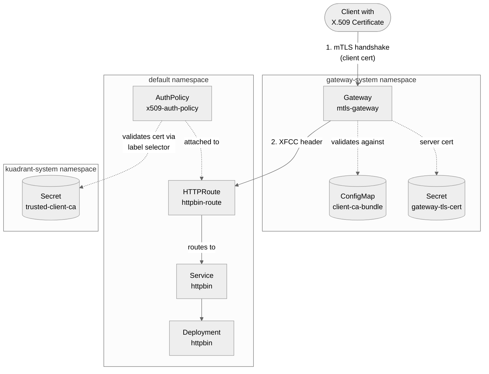

# Tier 1: Authenticate clients with Gateway API frontend TLS validation

## When to use this approach

Use Tier 1 X.509 authentication when you have Gateway API v1.5+ and want the most secure, standards-based mTLS authentication with:

- **Defense-in-depth security**: Validation at both TLS (L4) and application (L7) layers
- **Cryptographic proof**: Gateway verifies client possesses the private key
- **Standard configuration**: No vendor-specific resources required
- **Automatic protection**: Gateway sanitizes XFCC headers to prevent spoofing

This is the **recommended approach** for all Gateway API v1.5+ deployments.

## How it works

Tier 1 implements two-layer validation for defense-in-depth security:

**Layer 1 (TLS/L4)**: Gateway validates client certificates during TLS handshake
- Client presents certificate during mTLS handshake
- Gateway validates against CAs configured in `spec.tls.frontend.default.validation.caCertificateRefs`
- Invalid, expired, or untrusted certificates are rejected
- Gateway sets `x-forwarded-client-cert` (XFCC) header with certificate details
- Incoming XFCC headers from clients are automatically stripped

**Layer 2 (Application/L7)**: Authorino validates certificates from XFCC header
- Wasm-shim forwards XFCC header to Authorino
- Authorino extracts certificate from XFCC header
- Applies fine-grained validation using label selectors on CA Secrets
- Enables multi-CA trust scenarios

**Result**: Request proceeds only if both layers succeed.

## Before you begin

Ensure you have:

- **Kubernetes 1.31+**: Required for Gateway API v1.5 CEL validation rules
- **Gateway API v1.5+**: Must support `spec.tls.frontend.default.validation`
- **Compatible Gateway implementation**:
  - Istio v1.28+ (Sail Operator v1.28.0+ or upstream Istio via `istioctl`)
  - Envoy Gateway with v1.5 support
  - ⚠️ Istio 1.27.x and earlier do NOT support `spec.tls.frontend`
- **Kuadrant Operator**: Installed with Kuadrant instance deployed

## Step-by-step walkthrough

### Step 1: Prepare CA and client certificates

For testing, generate self-signed certificates. For production, use certificates from your PKI or cert-manager.

```bash
# Generate CA private key and certificate
openssl req -x509 -sha512 -nodes \
  -days 365 \
  -newkey rsa:4096 \
  -subj "/CN=Test CA/O=Kuadrant/C=US" \
  -addext basicConstraints=CA:TRUE \
  -addext keyUsage=digitalSignature,keyCertSign \
  -keyout /tmp/ca.key \
  -out /tmp/ca.crt

# Create X.509 v3 extensions file for client certificate
cat > /tmp/x509v3.ext << EOF
authorityKeyIdentifier=keyid,issuer
basicConstraints=CA:FALSE
keyUsage=digitalSignature,nonRepudiation,keyEncipherment,dataEncipherment
extendedKeyUsage=clientAuth
EOF

# Generate client private key and certificate signed by the CA
openssl genrsa -out /tmp/client.key 4096
openssl req -new \
  -subj "/CN=test-client/O=Kuadrant/C=US" \
  -key /tmp/client.key \
  -out /tmp/client.csr
openssl x509 -req -sha512 \
  -days 365 \
  -CA /tmp/ca.crt \
  -CAkey /tmp/ca.key \
  -CAcreateserial \
  -extfile /tmp/x509v3.ext \
  -in /tmp/client.csr \
  -out /tmp/client.crt
```

> [!IMPORTANT] Important
> Client certificates **must** include `extendedKeyUsage=clientAuth` for Authorino validation to succeed.

### Step 2: Create CA certificate resources

Create the CA certificate as a ConfigMap for gateway validation and as a Secret for Authorino validation:

```bash
# ConfigMap for Gateway TLS validation (Layer 1)
kubectl create configmap client-ca-bundle \
  -n gateway-system \
  --from-file=ca.crt=/tmp/ca.crt

# Secret for Authorino validation (Layer 2)
kubectl create secret generic trusted-client-ca \
  -n kuadrant-system \
  --from-file=ca.crt=/tmp/ca.crt

# Label the secret so Authorino can discover it
kubectl label secret trusted-client-ca \
  -n kuadrant-system \
  authorino.kuadrant.io/managed-by=authorino \
  app.kubernetes.io/name=trusted-client
```

**Why two resources?**
- **ConfigMap**: Gateway reads CA certificates from ConfigMaps for TLS validation
- **Secret**: Authorino reads CA certificates from labeled TLS Secrets for application-layer validation

### Step 3: Configure Gateway with frontend TLS validation

Create a Gateway with `spec.tls.frontend.default.validation` to enable client certificate validation at the TLS layer:

> [!NOTE]
> The example file below also includes a cert-manager Issuer and TLSPolicy for automated server certificate provisioning. The Gateway configuration shown here highlights the key mTLS validation settings.

```yaml
apiVersion: gateway.networking.k8s.io/v1
kind: Gateway
metadata:
  name: mtls-gateway
  namespace: gateway-system
spec:
  gatewayClassName: istio
  listeners:
  - name: https
    protocol: HTTPS
    port: 443
    hostname: "*.nip.io"
    allowedRoutes:
      namespaces:
        from: All
    tls:
      mode: Terminate
      certificateRefs:
      - name: gateway-tls-cert  # Server certificate for TLS termination
        kind: Secret
  # Frontend TLS validation for client certificates
  tls:
    frontend:
      default:
        validation:
          # Reference ConfigMap with trusted CA certificates
          caCertificateRefs:
          - name: client-ca-bundle
            kind: ConfigMap
            group: ""
          # Require valid client certificates (reject invalid ones at TLS layer)
          mode: AllowValidOnly  # or AllowInsecureFallback for optional mTLS
```

**Key configuration**:
- `caCertificateRefs`: References the ConfigMap containing CA certificates in PEM format
- `mode: AllowValidOnly`: Requires valid client certificates; connections without certificates or with invalid certificates are rejected during TLS handshake
- `mode: AllowInsecureFallback`: Allows connections without client certificates (optional mTLS)

Apply the Gateway:

```bash
kubectl apply -f https://raw.githubusercontent.com/Kuadrant/kuadrant-operator/refs/heads/main/examples/x509-authentication/gateway.yaml
```

**What happens**: Gateway now validates client certificates during TLS handshake and sets the XFCC header for valid connections.

### Step 4: Deploy the protected application

Deploy a test application to protect with X.509 authentication:

```bash
kubectl apply -f https://raw.githubusercontent.com/Kuadrant/kuadrant-operator/refs/heads/main/examples/x509-authentication/httpbin.yaml
```

This creates a Deployment and Service for the httpbin test application.

### Step 5: Create an HTTPRoute

Route traffic from the Gateway to the application:

```bash
kubectl apply -f https://raw.githubusercontent.com/Kuadrant/kuadrant-operator/refs/heads/main/examples/x509-authentication/httproute.yaml
```

Example HTTPRoute:

```yaml
apiVersion: gateway.networking.k8s.io/v1
kind: HTTPRoute
metadata:
  name: httpbin-route
  namespace: default
spec:
  parentRefs:
  - name: mtls-gateway
    namespace: gateway-system
  rules:
  - matches:
    - path:
        type: PathPrefix
        value: /
    backendRefs:
    - name: httpbin
      port: 80
```

### Step 6: Configure AuthPolicy for L7 validation

Create an AuthPolicy that extracts the certificate from the XFCC header and validates it using label selectors:

```yaml
apiVersion: kuadrant.io/v1
kind: AuthPolicy
metadata:
  name: x509-auth-policy
  namespace: default
spec:
  targetRef:
    group: gateway.networking.k8s.io
    kind: HTTPRoute
    name: httpbin-route
  rules:
    # Authentication using client certificate from XFCC header
    authentication:
      "x509-client-cert":
        x509:
          # Extract certificate from XFCC header set by gateway
          source:
            xfccHeader: "x-forwarded-client-cert"
          # Select trusted CA certificates using labels
          selector:
            matchLabels:
              app.kubernetes.io/name: trusted-client

    # Optional: Enforce authorization based on certificate attributes
    authorization:
      "verify-organization":
        patternMatching:
          patterns:
          - predicate: "size(auth.identity.Organization) > 0 && auth.identity.Organization[0] == 'Kuadrant'"

    # Optional: Inject certificate attributes into request headers
    response:
      success:
        headers:
          "x-client-common-name":
            plain:
              expression: auth.identity.CommonName
          "x-client-org":
            plain:
              expression: auth.identity.Organization[0]
```

Apply the AuthPolicy:

```bash
kubectl apply -f https://raw.githubusercontent.com/Kuadrant/kuadrant-operator/refs/heads/main/examples/x509-authentication/authpolicy.yaml
```

**Configuration breakdown**:
- `source.xfccHeader`: Extracts certificate from the XFCC header (set by gateway after TLS validation)
- `selector.matchLabels`: Selects CA Secrets with matching labels for trust validation
- `authorization`: Optional CEL expressions to enforce attribute-based policies
- `response.success.headers`: Optional certificate attribute injection into request headers

## Verify defense-in-depth security

Test all authentication scenarios to confirm both validation layers work correctly.

### Test 1: Valid certificate (both layers pass)

```bash
GATEWAY_IP=$(kubectl get gateway mtls-gateway -n gateway-system -o jsonpath='{.status.addresses[0].value}')

curl -ik https://httpbin.$GATEWAY_IP.nip.io/get \
  --cert /tmp/client.crt \
  --key /tmp/client.key
```

**Expected**: HTTP 200 response. Request succeeds because:
1. ✅ Layer 1: Gateway validates certificate during TLS handshake
2. ✅ Layer 2: Authorino validates certificate from XFCC header

### Test 2: No certificate (Layer 1 rejects)

```bash
curl -ik https://httpbin.$GATEWAY_IP.nip.io/get
```

**Expected**: TLS handshake fails. Connection rejected at Layer 1 because `mode: AllowValidOnly` requires a client certificate.

### Test 3: Untrusted certificate (Layer 1 rejects)

```bash
# Generate self-signed certificate not signed by the CA
openssl req -x509 -newkey rsa:2048 -nodes \
  -keyout /tmp/untrusted.key -out /tmp/untrusted.crt -days 365 \
  -subj "/CN=untrusted-client/O=Untrusted/C=US"

# Try to connect
curl -ik https://httpbin.$GATEWAY_IP.nip.io/get \
  --cert /tmp/untrusted.crt \
  --key /tmp/untrusted.key
```

**Expected**: TLS handshake fails. Gateway rejects connection because certificate is not signed by a trusted CA.

### Test 4: Valid certificate with unauthorized attributes (Layer 2 rejects)

```bash
# Generate CA-signed certificate with Organization != "Kuadrant"
openssl genrsa -out /tmp/unauthorized-client.key 4096
openssl req -new \
  -subj "/CN=unauthorized-client/O=Unauthorized/C=US" \
  -key /tmp/unauthorized-client.key \
  -out /tmp/unauthorized-client.csr
openssl x509 -req -sha512 \
  -days 365 \
  -CA /tmp/ca.crt \
  -CAkey /tmp/ca.key \
  -CAcreateserial \
  -extfile /tmp/x509v3.ext \
  -in /tmp/unauthorized-client.csr \
  -out /tmp/unauthorized-client.crt

# Try to connect
curl -ik https://httpbin.$GATEWAY_IP.nip.io/get \
  --cert /tmp/unauthorized-client.crt \
  --key /tmp/unauthorized-client.key
```

**Expected**: HTTP 403 Forbidden. Request succeeds at Layer 1 (valid certificate chain) but fails at Layer 2 because the authorization rule requires `Organization == "Kuadrant"`.

## What you can do next

### Use certificate attributes for authorization

Extract certificate subject fields for authorization decisions:

```yaml
authorization:
  "department-access":
    patternMatching:
      patterns:
      - predicate: "'Engineering' in auth.identity.OrganizationalUnit"
  "regional-access":
    patternMatching:
      patterns:
      - predicate: "auth.identity.Country[0] == 'US' && auth.identity.Province[0] == 'California'"
```

**Available identity fields**: `CommonName`, `Country`, `Organization`, `OrganizationalUnit`, `Locality`, `Province`, `StreetAddress`, `PostalCode`, `SerialNumber`

### Inject certificate claims into request headers

Forward certificate attributes to your application:

```yaml
response:
  success:
    headers:
      "x-client-subject":
        json:
          properties:
            cn:
              expression: auth.identity.CommonName
            org:
              expression: auth.identity.Organization[0]
            ou:
              expression: auth.identity.OrganizationalUnit
```

### Implement multi-CA trust

Trust different CAs for different routes or environments:

```yaml
# AuthPolicy for production routes
x509:
  selector:
    matchLabels:
      environment: production
      tier: customer-facing
---
# AuthPolicy for internal routes
x509:
  selector:
    matchLabels:
      environment: internal
      tier: employee
```

Create CA Secrets with appropriate labels:

```bash
kubectl label secret production-ca \
  -n kuadrant-system \
  environment=production \
  tier=customer-facing

kubectl label secret internal-ca \
  -n kuadrant-system \
  environment=internal \
  tier=employee
```

### Automate certificate management with cert-manager

Use [cert-manager](https://cert-manager.io/) to automate CA certificate provisioning and rotation:

```yaml
apiVersion: cert-manager.io/v1
kind: Certificate
metadata:
  name: client-ca
  namespace: kuadrant-system
spec:
  secretName: trusted-client-ca
  commonName: "Kuadrant Client CA"
  isCA: true
  issuerRef:
    name: root-ca-issuer
    kind: Issuer
```

Add labels to the cert-manager Certificate resource:

```yaml
spec:
  secretTemplate:
    labels:
      authorino.kuadrant.io/managed-by: authorino
      app.kubernetes.io/name: trusted-client
```

## Topology diagram

The following diagram illustrates the component relationships and request flow:



## Troubleshooting

### XFCC header not populated

**Symptoms**: Authorino rejects requests with "certificate not found" or "missing XFCC header"

**Possible causes**:
- Gateway not configured with `spec.tls.frontend.default.validation`
- Client didn't present certificate during TLS handshake
- Gateway implementation doesn't support frontend TLS validation

**Resolution**:
```bash
# Verify Gateway configuration
kubectl get gateway mtls-gateway -n gateway-system -o yaml | grep -A 10 frontend

# Check Authorino logs for XFCC header
kubectl logs -n kuadrant-system -l authorino-resource-uid=<uid> | grep -i xfcc

# Test TLS handshake manually
openssl s_client -connect $GATEWAY_IP:443 \
  -cert /tmp/client.crt -key /tmp/client.key \
  -servername httpbin.$GATEWAY_IP.nip.io
```

### Certificate validation fails at Layer 2

**Symptoms**: TLS handshake succeeds but Authorino returns 403

**Possible causes**:
- CA Secret not labeled correctly
- Label selector doesn't match any CA Secrets
- Certificate missing `extendedKeyUsage=clientAuth`
- Authorization rules reject certificate attributes

**Resolution**:
```bash
# Verify CA Secret labels
kubectl get secret trusted-client-ca -n kuadrant-system --show-labels

# Check if selector matches
kubectl get secrets -n kuadrant-system -l app.kubernetes.io/name=trusted-client

# Verify certificate has Client Auth EKU
openssl x509 -in /tmp/client.crt -noout -text | grep "TLS Web Client Authentication"

# Check Authorino logs
kubectl logs -n kuadrant-system -l authorino-resource-uid=<uid> | grep x509
```

### Gateway rejects valid certificates

**Symptoms**: TLS handshake fails even with valid CA-signed certificate

**Possible causes**:
- ConfigMap doesn't contain CA certificate in PEM format
- Certificate chain incomplete
- Certificate expired
- Gateway implementation issue

**Resolution**:
```bash
# Verify ConfigMap contains PEM-encoded CA
kubectl get configmap client-ca-bundle -n gateway-system -o yaml

# Check certificate validity
openssl x509 -in /tmp/client.crt -noout -dates

# Verify certificate chain
openssl verify -CAfile /tmp/ca.crt /tmp/client.crt

# Check gateway logs
kubectl logs -n gateway-system -l istio=ingressgateway
```

## See also

- [X.509 Authentication Overview](../../overviews/auth-x509.md) - Architecture and security model
- [X.509 Authentication User Guides](x509-authentication.md) - Choose the right tier for your needs
- [Tier 2 Guide](x509-tier2-provider-specific.md) - Alternative for older Gateway API versions
- [AuthPolicy API Reference](../../reference/authpolicy.md) - Complete API specification
- [Gateway API v1.5 TLS Frontend Validation](https://gateway-api.sigs.k8s.io/api-types/gateway/#gateway-api-v1-TLSFrontendValidation)
- [Envoy XFCC Header Documentation](https://www.envoyproxy.io/docs/envoy/latest/configuration/http/http_conn_man/headers#x-forwarded-client-cert)
- [Authorino X.509 Authentication](https://docs.kuadrant.io/latest/authorino/docs/features/#x509-client-certificate-authentication-authenticationx509)
