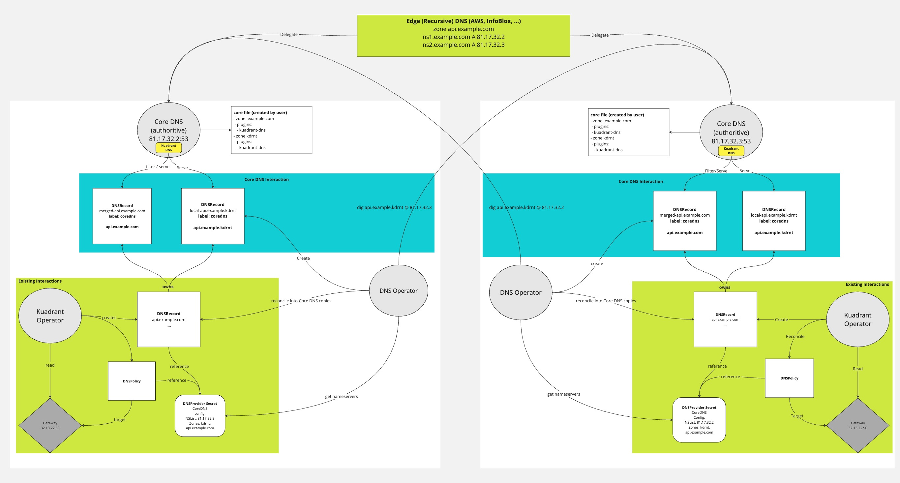

## CoreDNS with Kuadrant

With this guide, you will learn how to setup Kuadrant to use CoreDNS via the Kuadrant `DNSPolicy` and leverage CoreDNS as the authoritative nameserver(s) for a given domain shared across multiple gateways to provide both a weighted and GEO based DNS response similar to that offered by common cloud providers.


>Note: Core DNS support is intended for evaluation and feedback only. This guide makes use of a developer preview version of the CoreDNS integration and is **not** intended for production use.

The basic architecture for how the CoreDNS integration works is shown in the image below:



### Overview

Kuadrant's DNS Operator will create an authoritative DNSRecord for any DNSRecord that reference a CoreDNS provider secret directly or via a "default" provider secret.
The authoritative record is named and labeled in a deterministic way using the source DNSRecord root host and contains all the endpoints related to that root host which could be coming from multiple DNSRecord sources.
The DNS Operator can be configured to read DNSRecords from multiple clusters allowing DNSRecords in the same namespace with the same root host to form a single authoritative merged record set on selected "primary" clusters. 
Kuadrant's custom CoreDNS plugin, will read and serve the authoritative record. 
If there is provider specific meta data for weight and GEO, the kuadrant plugin will apply GEO location filtering (assuming there is an appropriate GEO database configured) and a weighted response to any DNS queries for the dns names in those records.

This guide shows the manual steps required to configure the kuadrant CoreDNS integration in a multi cluster setup (Two primary clusters and one secondary).  

## Prerequisites

- Kubernetes cluster(s) (Three to test all functionality described in this guide)
- Kuadrant installed on each cluster

### Local Kind clusters [Optional]

If you want to see how this works locally and are not using existing clusters, the easiest approach is to use kind to create local clusters.

To try this out you can use the local-setup helper from the kuadrant-operator repo:
```
git clone https://github.com/Kuadrant/kuadrant-operator.git
```

Run the following from the root of the repo:
```shell
CLUSTER_COUNT=3 ./hack/multicluster.sh local-setup
```

This will create three local Kind clusters with Kuadrant installed, you can set the context env vars used in the rest of this guide by running the following:
```shell
export CTX_PRIMARY1=kind-kuadrant-local-1
export CTX_PRIMARY2=kind-kuadrant-local-2
export CTX_SECONDARY1=kind-kuadrant-local-3
```

## Setup Cluster 1 and 2 (Primary)

At least one cluster must be configured as a primary. 
A primary cluster that is intended to be used with the CoreDNS provider should have a CoreDNS instance running with the Kuadrant plugin enabled.
A primary cluster should have cluster kubeconfig secrets added for all other clusters.
A primary cluster should have dns provider (coredns) secrets in target namespaces.

### Install CoreDNS

You can install CoreDNS configured with the kuadrant plugin using the follow kustomize command while kubectl is targeting the desired cluster, this will install CoreDNS into the `kuadrant-coredns` namespace:
```shell
kustomize build --enable-helm https://github.com/Kuadrant/dns-operator/config/coredns | kubectl apply --context ${CTX_PRIMARY1} -f -
kustomize build --enable-helm https://github.com/Kuadrant/dns-operator/config/coredns | kubectl apply --context ${CTX_PRIMARY2} -f -

kubectl wait --timeout=90s --for=condition=Ready=True pods -A -l app.kubernetes.io/name=coredns --context ${CTX_PRIMARY1}
kubectl wait --timeout=90s --for=condition=Ready=True pods -A -l app.kubernetes.io/name=coredns --context ${CTX_PRIMARY2}

kubectl get deployments -A -l app.kubernetes.io/name=coredns --context ${CTX_PRIMARY1}
kubectl get deployments -A -l app.kubernetes.io/name=coredns --context ${CTX_PRIMARY2}
```

#### OpenShift on AWS

If you are using an OpenShift cluster on AWS you will also need to run the following commands:

```shell
kubectl patch service kuadrant-coredns --type='json' -p='[{"op": "remove", "path": "/spec/externalTrafficPolicy"}]' -n kuadrant-coredns --context ${CTX_PRIMARY1}
kubectl patch service kuadrant-coredns --type='json' -p='[{"op": "remove", "path": "/spec/externalTrafficPolicy"}]' -n kuadrant-coredns --context ${CTX_PRIMARY2}
kubectl annotate service/kuadrant-coredns service.beta.kubernetes.io/aws-load-balancer-type=nlb -n kuadrant-coredns --context ${CTX_PRIMARY1}
kubectl annotate service/kuadrant-coredns service.beta.kubernetes.io/aws-load-balancer-type=nlb -n kuadrant-coredns --context ${CTX_PRIMARY2}
```

>Note: OpenShift on AWS does not currently support exposing a single port on both UDP and TCP, so in this setup only UDP port 53 is exposed via the ELB.

#### Verify

Check that the CoreDNS instances are available and responding to queries:
```shell
NS1=`kubectl get service/kuadrant-coredns -n kuadrant-coredns -o yaml --context ${CTX_PRIMARY1} | yq '.status.loadBalancer.ingress[0].ip'`
NS2=`kubectl get service/kuadrant-coredns -n kuadrant-coredns -o yaml --context ${CTX_PRIMARY2} | yq '.status.loadBalancer.ingress[0].ip'`
echo $NS1
echo $NS2
dig @${NS1} -t AXFR k.example.com
dig @${NS2} -t AXFR k.example.com
```

#### Zone Configuration

A default zone (k.example.com) is created for testing purposes.
This can be replaced, or additional zones added, as desired by modifying the "Corefile" on each primary cluster.

```shell
kubectl get configmap/kuadrant-coredns -n kuadrant-coredns -o yaml --context ${CTX_PRIMARY1} | yq .data
kubectl get configmap/kuadrant-coredns -n kuadrant-coredns -o yaml --context ${CTX_PRIMARY2} | yq .data
```

The sample CoreDNS configuration is generated from this file: [CoreDNS Configuration](https://raw.githubusercontent.com/Kuadrant/dns-operator/refs/heads/main/config/coredns/Corefile). 
That domain name can be changed or duplicated to add other domains as required.

For more information on configuring CoreDNS please refer to their [documentation](https://coredns.io/manual/configuration/).

#### Using a GEO IP database

The CoreDNS instances will need to be configured to use a GEO IP database, in the example above this is called: `GeoLite2-City-demo.mmdb`. 
This is a mock database we provide to for illustrative purposes. 
Change this to refer to your maxmind database file, for more information see [here](https://www.maxmind.com/en/geoip-databases).

For more information on configuring the CoreDNS geoip plugin please refer to their [documentation](https://coredns.io/plugins/geoip/).

#### Delegate the zones (public cluster only)

This cannot be done when testing locally, but assuming the CoreDNS instance is running on a publicly accessible IP which permits traffic on port 53, then the zone(s) in use will need to be delegated to these nameservers.
For testing and evaluation we would recommend creating a fresh zone.

This is done by creating an NS record in the zone hosted by the authoritative nameserver.

For example, if there is a domain example.com with authoritative nameservers in Route53, and 2 CoreDNS instances are configured with the zone k.example.com (on IPs 1.2.3.4 and 2.3.4.5).
Then in the example.com zone in Route53 the following records need to be created:
```
coredns1.example.com. IN A 60 1.2.3.4
coredns2.example.com. IN A 60 2.3.4.5
k.example.com. IN NS 300 coredns1.example.com.
k.example.com. IN NS 300 coredns2.example.com.
```

If the CoreDNS instances are not publicly accessible, then we will be able to verify them using the `@` modifier on a dig command.

### DNS Operator Configuration

Clusters being configured as "primary" should have the delegation role of the running dns operator set to "primary".
This is currently the default so nothing needs to be done here.

### Add Cluster Kubeconfig Secrets

In order for each primary cluster to read DNSRecord resources from all other clusters (primary or secondary) a cluster secret containing kubeconfig data for each of the other clusters must be added.
The `kubectl_kuadrant-dns` plugin provides a command to help create a valid cluster secret from the expected service account on the target cluster.

Refer to the [CLI documentation](https://github.com/Kuadrant/dns-operator/blob/main/docs/cli.md) for more information on how to install the plugin.

Assuming the `kubectl_kuadrant-dns` plugin is in the system path, you can run the following to connect all clusters to each primary:

```shell
# Set current context to primary 1
kubectl config use-context ${CTX_PRIMARY1}
kubectl_kuadrant-dns add-cluster-secret --context ${CTX_PRIMARY2} --namespace kuadrant-system
kubectl_kuadrant-dns add-cluster-secret --context ${CTX_SECONDARY1} --namespace kuadrant-system
# Set current context to primary 2
kubectl config use-context ${CTX_PRIMARY2}
kubectl_kuadrant-dns add-cluster-secret --context ${CTX_PRIMARY1} --namespace kuadrant-system
kubectl_kuadrant-dns add-cluster-secret --context ${CTX_SECONDARY1} --namespace kuadrant-system
```

If you are using Kind clusters (created via `./hack/multicluster.sh`) the above will produce invalid kubeconfig data. 
As a temporary workaround you can run the following from the root of the kuadrant-operator repo:
```shell
../../../hack/multicluster.sh create-cluster-secret ${CTX_PRIMARY1} ${CTX_PRIMARY2}
../../../hack/multicluster.sh create-cluster-secret ${CTX_PRIMARY1} ${CTX_SECONDARY1}
../../../hack/multicluster.sh create-cluster-secret ${CTX_PRIMARY2} ${CTX_PRIMARY1}
../../../hack/multicluster.sh create-cluster-secret ${CTX_PRIMARY2} ${CTX_SECONDARY1}
```

#### Verify

Check the cluster secrets exist on the primary clusters:
```shell
kubectl get secret -A -l kuadrant.io/multicluster-kubeconfig=true --context ${CTX_PRIMARY1}
kubectl get secret -A -l kuadrant.io/multicluster-kubeconfig=true --context ${CTX_PRIMARY2}
kubectl get secret -A -l kuadrant.io/multicluster-kubeconfig=true --context ${CTX_SECONDARY1}
```

Check the cluster secret content is valid kubeconfig data:
```shell
kubectl get secret kind-kuadrant-local-2 -n kuadrant-system --context ${CTX_PRIMARY1} -o jsonpath='{.data.kubeconfig}' | base64 -d
```

### Create test namespace (dnstest)

```shell
kubectl create ns dnstest --context ${CTX_PRIMARY1}
kubectl create ns dnstest --context ${CTX_PRIMARY2}
```

#### Add coredns provider secrets

The CoreDNS provider secret should be created with the desired zones configured. In this case we create it for the test zone (k.example.com):
```shell
kubectl create secret generic dns-provider-coredns --namespace=dnstest --type=kuadrant.io/coredns --from-literal=ZONES="k.example.com" --context ${CTX_PRIMARY1}
kubectl create secret generic dns-provider-coredns --namespace=dnstest --type=kuadrant.io/coredns --from-literal=ZONES="k.example.com" --context ${CTX_PRIMARY2}
```

Set the CoreDNS provider as the default allowing it to be selected when none is specified by the DNSPolicy:
```shell
kubectl label secret/dns-provider-coredns -n dnstest kuadrant.io/default-provider=true --context ${CTX_PRIMARY1}
kubectl label secret/dns-provider-coredns -n dnstest kuadrant.io/default-provider=true --context ${CTX_PRIMARY2}
```

## Setup Cluster 3 (Secondary)

Secondary clusters are optional.
A secondary does not have CoreDNS installed.
A secondary cluster does not have cluster kubeconfig secrets added.
A secondary cluster does not have provider credentials.

### DNS Operator Configuration

Clusters being configured as "secondary" should have the delegation role of the running dns operator set to "secondary".

This can be done by updating the dns operators configuration configmap(dns-operator-controller-env) in the kuadrant-system namespace and restarting the service:
```shell
kubectl patch configmap dns-operator-controller-env -n kuadrant-system --type merge -p '{"data":{"DELEGATION_ROLE":"secondary"}}' --context ${CTX_SECONDARY1}
kubectl scale deployment/dns-operator-controller-manager -n kuadrant-system --replicas=0 --context ${CTX_SECONDARY1}
kubectl scale deployment/dns-operator-controller-manager -n kuadrant-system --replicas=1 --context ${CTX_SECONDARY1}
kubectl rollout status deployment/dns-operator-controller-manager -n kuadrant-system --timeout=300s --context ${CTX_SECONDARY1}
kubectl logs deployment/dns-operator-controller-manager -n kuadrant-system --context ${CTX_SECONDARY1} | grep "delegationRole"
```

### Create test namespace (dnstest)

```shell
kubectl create ns dnstest --context ${CTX_SECONDARY1}
```

Cluster Setup complete, ready to deploy application!!

## Deploy Toystore application

Deploy the toystore application on all clusters:
```shell
kubectl apply -f https://raw.githubusercontent.com/Kuadrant/Kuadrant-operator/main/examples/toystore/toystore.yaml -n dnstest --context ${CTX_PRIMARY1}
kubectl apply -f https://raw.githubusercontent.com/Kuadrant/Kuadrant-operator/main/examples/toystore/toystore.yaml -n dnstest --context ${CTX_PRIMARY2}
kubectl apply -f https://raw.githubusercontent.com/Kuadrant/Kuadrant-operator/main/examples/toystore/toystore.yaml -n dnstest --context ${CTX_SECONDARY1}

kubectl -n dnstest wait --for=condition=Available deployments toystore --timeout=60s --context ${CTX_PRIMARY1}
kubectl -n dnstest wait --for=condition=Available deployments toystore --timeout=60s --context ${CTX_PRIMARY2}
kubectl -n dnstest wait --for=condition=Available deployments toystore --timeout=60s --context ${CTX_SECONDARY1}
```

### Create an Ingress Gateway

Create a gateway using the coredns zone name as part of a listener hostname on all clusters:

```sh
gateway=$(cat <<EOF
apiVersion: gateway.networking.k8s.io/v1
kind: Gateway
metadata:
  name: external
  namespace: dnstest
  labels:
    kuadrant.io/gateway: "true"
spec:
  gatewayClassName: istio
  listeners:
    - name: http
      protocol: HTTP
      port: 80
      allowedRoutes:
        namespaces:
          from: All
      hostname: "api.toystore.k.example.com" 
EOF)

echo "${gateway}" | kubectl apply --context ${CTX_PRIMARY1} -f -
echo "${gateway}" | kubectl apply --context ${CTX_PRIMARY2} -f -
echo "${gateway}" | kubectl apply --context ${CTX_SECONDARY1} -f -
```

### Setup Toystore application HTTPRoute

```bash
httproute=$(cat <<EOF
apiVersion: gateway.networking.k8s.io/v1
kind: HTTPRoute
metadata:
  name: toystore
  namespace: dnstest
  labels:
    deployment: toystore
    service: toystore
spec:
  parentRefs:
  - name: external
    namespace: dnstest
  hostnames:
  - "api.toystore.k.example.com"
  rules:
  - matches:
    - method: GET
      path:
        type: PathPrefix
        value: "/cars"
    backendRefs:
    - name: toystore
      port: 80  
EOF
)

echo "${httproute}" | kubectl apply --context ${CTX_PRIMARY1} -f -
echo "${httproute}" | kubectl apply --context ${CTX_PRIMARY2} -f -
echo "${httproute}" | kubectl apply --context ${CTX_SECONDARY1} -f -
```

### Verify

```shell
kubectl get gateway,httproute,service,deployment,all --context ${CTX_PRIMARY1} -n dnstest
kubectl get gateway,httproute,service,deployment,all --context ${CTX_PRIMARY2} -n dnstest
kubectl get gateway,httproute,service,deployment,all --context ${CTX_SECONDARY1} -n dnstest
```

### Enable DNS on the gateway

Create a Kuadrant `DNSPolicy` to configure DNS on all clusters:

```shell
dnspolicyeu=$(cat <<EOF
apiVersion: kuadrant.io/v1
kind: DNSPolicy
metadata:
  name: external-dns
  namespace: dnstest
spec:
  targetRef:
    name: external
    group: gateway.networking.k8s.io
    kind: Gateway
  loadBalancing:
    weight: 100
    geo: GEO-EU
    defaultGeo: true
  delegate: true
EOF
)
dnspolicyus=$(cat <<EOF
apiVersion: kuadrant.io/v1
kind: DNSPolicy
metadata:
  name: external-dns
  namespace: dnstest
spec:
  targetRef:
    name: external
    group: gateway.networking.k8s.io
    kind: Gateway
  loadBalancing:
    weight: 125
    geo: GEO-NA
    defaultGeo: false
  delegate: true
EOF
)
  
echo "${dnspolicyeu}" | kubectl apply --context ${CTX_PRIMARY1} -f -
echo "${dnspolicyus}" | kubectl apply --context ${CTX_PRIMARY2} -f -
echo "${dnspolicyeu}" | kubectl apply --context ${CTX_SECONDARY1} -f -
```

### Verify

Check the DNSRecord resources on each cluster: 
```shell
kubectl get dnsrecord -n dnstest -o wide --context ${CTX_PRIMARY1}
kubectl get dnsrecord -n dnstest -o wide --context ${CTX_PRIMARY2}
kubectl get dnsrecord -n dnstest -o wide --context ${CTX_SECONDARY1}
```

Check the authoritative DNSRecord resources on each primary:
```shell
kubectl get dnsrecord/authoritative-record-oii1lttl -n dnstest -o json --context ${CTX_PRIMARY1} | jq -r '.spec.endpoints[] | "dnsName: \(.dnsName), recordType: \(.recordType), targets: \(.targets)"'
kubectl get dnsrecord/authoritative-record-oii1lttl -n dnstest -o json --context ${CTX_PRIMARY2} | jq -r '.spec.endpoints[] | "dnsName: \(.dnsName), recordType: \(.recordType), targets: \(.targets)"'
```

Check the k.example.com zone on each CoreDNS instance contains the expected records:
```shell
NS1=`kubectl get service/kuadrant-coredns -n kuadrant-coredns -o yaml --context ${CTX_PRIMARY1} | yq '.status.loadBalancer.ingress[0].ip'`
NS2=`kubectl get service/kuadrant-coredns -n kuadrant-coredns -o yaml --context ${CTX_PRIMARY2} | yq '.status.loadBalancer.ingress[0].ip'`
echo $NS1
echo $NS2
dig @${NS1} -t AXFR k.example.com
dig @${NS2} -t AXFR k.example.com
```

Check the CoreDNS instances respond as expected:
```shell
NS1=`kubectl get service/kuadrant-coredns -n kuadrant-coredns -o yaml --context ${CTX_PRIMARY1} | yq '.status.loadBalancer.ingress[0].ip'`
NS2=`kubectl get service/kuadrant-coredns -n kuadrant-coredns -o yaml --context ${CTX_PRIMARY2} | yq '.status.loadBalancer.ingress[0].ip'`
dig @${NS1} api.toystore.k.example.com +short
dig @${NS2} api.toystore.k.example.com +short
```

Delete DNSPolicy from all clusters:
```shell
kubectl delete dnspolicy external-dns -n dnstest --context ${CTX_PRIMARY1}
kubectl delete dnspolicy external-dns -n dnstest --context ${CTX_PRIMARY2}
kubectl delete dnspolicy external-dns -n dnstest --context ${CTX_SECONDARY1}
```
