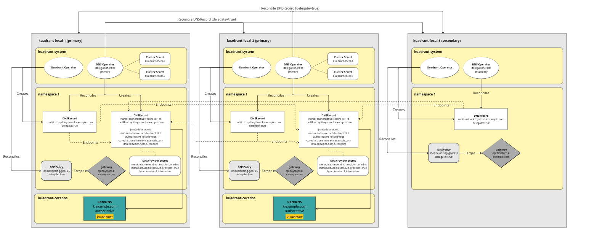

## Try out CoreDNS with Kuadrant

Kuadrant's DNS capabilities can be used with [CoreDNS](https://coredns.io/) at a proof of concept level. With this guide, you will learn how to setup Kuadrant to use CoreDNS via the Kuadrant `DNSPolicy` and leverage CoreDns as the authoritative nameserver(s) for a given domain shared across multiple gateways to provide both a weighted and GEO based DNS response similar to that offered by common cloud providers.


>Note: This guide uses a proof of concept and is intended only for experimenting and learning. It is not currently a core part of the Kuadrant DNS offering.


The basic architecture for how the Core DNS integration works is shown in the image below:




### Summary

Kuadrant's DNS Operator will convert existing DNSRecords that reference a CoreDNS provider secret into two additional "CoreDNS" specific DNSRecords (named and labeled in a deterministic way). One of these will be the local record set with no weighting or geo provider specific data and will be served under a `kdrnt` TLD. The other record will be a merged record set of both the local `kdrnt` record and the records of each other DNS server for the same dns name. The DNSOperator, via the provider secret, will be told about the set of nameservers it needs to query to form this single record set and will query these DNS servers directly and then merge their response into a single merged record set. This will mean each core dns will end up with the full record set for a given dns name. 

Kuadrant's custom CoreDNS plugin, will read and serve these two new records. If there is provider specific meta data for weight and GEO, the kuadrant plugin will apply GEO location filtering (assuming their is an appropriate GEO database configured) and a weighted response to any DNS queries for the dns names in those records. 


### Setup a local Kuadrant development environment with CoreDNS enabled

For this local setup we are going to use a single cluster rather than multiple to reduce the setup overhead. The same architecture is true, but rather than a core dns per cluster we have one per namespace (see image below). For this guide, we will have two instances of core dns.  


To try this out, clone the kuadrant-operator repo first:

```
git clone https://github.com/Kuadrant/kuadrant-operator.git
```

From the root of the kuadrant-operator repo execute:

```
make local-setup && ./bin/kustomize build --enable-helm https://github.com/Kuadrant/dns-operator/config/coredns-multi | kubectl apply -f -
```

This will install Kuadrant into a local kind cluster and configure the CoreDNS instances. Once you have Kuadrant installed, you will need to enable the CoreDNS provider integration and disable the health checks probes (which are not currently a part of this integration):


Update the flags to the container:

```
kubectl patch deployment dns-operator-controller-manager  --type='json' -p='[{"op": "replace", "path": "/spec/template/spec/containers/0/args", "value": ["--metrics-bind-address=:8080", "--leader-elect","--provider=coredns","--enable-probes=false"]}]'  -n kuadrant-system
```

To ensure stability, set the image of kuadrant-operator to the v1.0.2 rather than using main. If you want to use latest just set the tag to `latest` instead. 

```
kubectl set image deployment/kuadrant-operator-controller-manager *=quay.io/kuadrant/kuadrant-operator:v1.0.2 -n kuadrant-system
```


The environment is now setup. Next you will setup some gateways and DNS Policies that will trigger the creation of the needed DNSRecords:

### Setup the Gateways

To show this working but keep the setup simple and in a single cluster, lets now setup 2 gateways on the same cluster that have listeners for the same hostname. Then use DNSPolicy to define one location as the EU and the other as NA. Later these will be updated to show a weighted DNSResponse working.

As there are multiple instances of CoreDNS running and they are namespace scoped, our gateways and policies will be created in the same namespace as each of the dns servers. For convenience there are some gateways already defined.

> Note: these gateways use the k.example.com domain. This is pre-configured in the core dns corefile as a zone that uses the kuadrant CoreDns plugin.


```

kubectl apply -f examples/coredns/gateways.yaml

```

### Setup the DNSProvider secrets

To setup the DNSProvider secrets, you need to know the external IPAddress of each CoreDNS instance. This is to allow the DNS Operator to query each nameserver for its records to form a full record set for a given dns name.

```
export coredns1IP=$(kubectl get service kuadrant-coredns-1 -n kuadrant-coredns-1 -o=jsonpath='{.status.loadBalancer.ingress[0].ip}')
export coredns2IP=$(kubectl get service kuadrant-coredns-2 -n kuadrant-coredns-2 -o=jsonpath='{.status.loadBalancer.ingress[0].ip}')
```

Next you need to set the nameservers in the provider secret:

```

kubectl create secret generic core-dns --namespace=kuadrant-coredns-1 --type=kuadrant.io/coredns --from-literal=NAMESERVERS="${coredns1IP}:53,${coredns2IP}:53" --from-literal=ZONES="k.example.com"

kubectl create secret generic core-dns --namespace=kuadrant-coredns-2 --type=kuadrant.io/coredns --from-literal=NAMESERVERS="${coredns2IP}:53,${coredns1IP}:53" --from-literal=ZONES="k.example.com"
```

### Setup the DNSPolicies

Now that you have your gateways and providers in place, you can move on to setup the DNSPolicies. Again, for convenience, there is example for this guide.

```
kubectl apply -f examples/coredns/dnspolicies.yaml
```

>Note:  2 DNSPolicies are created. In a real world scenario each of these gateways and policies would likely be on a different cluster. In the 2 DNSPolicies the main difference is the one targeting the NA gateway has a GEO set of NA while the one targeting the EU gateway has a GEO set of EU.


### Validate and test the setup

You can verify that everything is as expected by checking the DNSPolicy status. It is likely to take a minute or so before the status is marked as enforced but you should see `enforced true` for each policy.

```
kubectl get dnspolicy -A -o=wide
```

Once they are all enforced. You can issue some queries against the local authoritative nameservers. 

>Note: as this is a local setup there is no edge recursive DNS server involved. In a real world scenario, a zone would be delegated to these CoreDNS instances from a dns provider such as AWS route53.

### Test GEO based routing

For testing purposes and convenience there is a populated a fake geo database loaded with a specific CIDR for each geo. It works the same as a normal GEO based database, it is just much smaller and only intended for test purposes.

>Note you can use either instance of the CoreDNS servers they will both return the same result

#### EU based geo.

A specific subnet is used here to ensure that core dns sees this as the originating IP which we have mapped to the EU region in our geo database.

```
dig @${coredns1IP} k.example.com +subnet=127.0.100.100 +short
dig @${coredns2IP} k.example.com +subnet=127.0.100.100 +short
```

Below is some sample output

```
dig @${coredns2IP} k.example.com +subnet=127.0.100.100 +short
klb.k.example.com.
geo-eu.klb.k.example.com.
1fopkr-332u3t.klb.k.example.com.
10.89.0.20

dig @${coredns1IP} k.example.com +subnet=127.0.100.100 +short
klb.k.example.com.
geo-eu.klb.k.example.com.
1fopkr-332u3t.klb.k.example.com.
10.89.0.20
```

#### US based geo.

To test US based geo, update the subnet and hit the namesevers again:

```
dig @${coredns1IP} k.example.com +subnet=127.0.200.200 +short
dig @${coredns2IP} k.example.com +subnet=127.0.200.200 +short
```

Below is a sample output

```
dig @${coredns1IP} k.example.com +subnet=127.0.200.200 +short
klb.k.example.com.
geo-na.klb.k.example.com.
1fopkr-2y5vu7.klb.k.example.com.
10.89.0.19

dig @${coredns2IP} k.example.com +subnet=127.0.200.200 +short
klb.k.example.com.
geo-na.klb.k.example.com.
1fopkr-2y5vu7.klb.k.example.com.
10.89.0.19
```

### Test Weighted routing

As there are only have 2 CoreDNS instances on the local cluster, you will need to modify one of the existing DNSPolicies so that both gateways are considered to be in the same Geo:

```
kubectl patch dnspolicy dnspolicy-na -n kuadrant-coredns-1 --type='json' -p='[{"op": "replace", "path": "/spec/loadBalancing/geo","value": "GEO-EU"},{"op": "replace", "path": "/spec/loadBalancing/defaultGeo", "value": true},{"op": "replace", "path": "/spec/loadBalancing/weight", "value": 100 }]'
```

Now you can re-run the DNS queries:

```
for i in {1..20}; do dig @${coredns2IP} k.example.com +subnet=127.0.100.100  +short; sleep 1;  done
for i in {1..20}; do dig @${coredns1IP} k.example.com +subnet=127.0.100.100  +short; sleep 1;  done

```

Again you should see a similar response from both nameservers with the IPAddresses alternating from time to time (although due to cache it may not be a perfect 50/50 split)

example response:

```
klb.k.example.com.
geo-eu.klb.k.example.com.
15u8qo-2y5vu7.klb.k.example.com.
10.89.0.19
klb.k.example.com.
geo-eu.klb.k.example.com.
15u8qo-2y5vu7.klb.k.example.com.
10.89.0.19
klb.k.example.com.
geo-eu.klb.k.example.com.
15u8qo-332u3t.klb.k.example.com.
10.89.0.20
```
