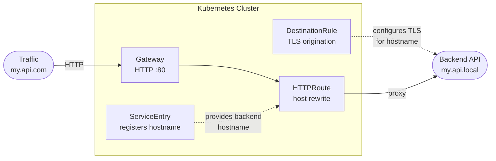

# Using Gateway API and Kuadrant with an external API



## Requirements

This guide uses Istio as the gateway provider. The pattern relies on three Istio-specific capabilities that the gateway provider must support:

1. **ServiceEntry** — registers an external hostname in the service mesh so it becomes routable
2. **DestinationRule** — configures TLS origination to the external backend
3. **`Hostname` backendRef** (`group: networking.istio.io`) — allows an HTTPRoute to reference the ServiceEntry as a backend
4. **`HTTPRouteHostRewrite`** — the [URLRewrite hostname filter](https://gateway-api.sigs.k8s.io/guides/user-guides/http-redirect-rewrite/) is an Extended Gateway API feature; the gateway provider must support it

If you are using a different gateway provider, check whether it supports these or equivalent mechanisms. For a list of supported providers, see the [Getting Started](https://docs.kuadrant.io/latest/getting-started/) guide.

The `openshift-default` GatewayClass installs a lightweight Istio via the Ingress Operator, but restricts the API surface to standard Gateway API resources — vendor-specific Istio resources are not supported. See [Configuring Gateway API](https://docs.redhat.com/en/documentation/openshift_container_platform/4.22/html/ingress_and_load_balancing/configuring-gateway-api) for details on what is available, and [Integrate OpenShift Gateway API with OpenShift Service Mesh](https://developers.redhat.com/articles/2025/12/09/integrate-openshift-gateway-api-openshift-service-mesh) for adding full Service Mesh support.

| Requirement | Notes |
|------------|-------|
| Kuadrant with **Istio** gateway provider | ServiceEntry, DestinationRule, and `kind: Hostname` backendRef require Istio |
| Network connectivity to the backend | The cluster must reach the backend API over the network |

## Step 1: Register the backend API

Istio needs a [ServiceEntry](https://istio.io/latest/docs/reference/config/networking/service-entry/) to register the backend hostname and a [DestinationRule](https://istio.io/latest/docs/reference/config/networking/destination-rule/) to configure TLS origination.

```bash
export EXTERNAL_HOST=my.api.com        # public hostname
export INTERNAL_HOST=my.api.local      # backend hostname (reachable from cluster)
```

```bash
kubectl apply -n gateway-system -f - <<EOF
apiVersion: networking.istio.io/v1
kind: ServiceEntry
metadata:
  name: backend-api
spec:
  hosts:
    - ${INTERNAL_HOST}
  location: MESH_EXTERNAL
  resolution: DNS
  ports:
    - number: 443
      name: https
      protocol: HTTPS
---
apiVersion: networking.istio.io/v1
kind: DestinationRule
metadata:
  name: backend-api
spec:
  host: ${INTERNAL_HOST}
  trafficPolicy:
    tls:
      mode: SIMPLE
      sni: ${INTERNAL_HOST}
EOF
```

## Step 2: Deploy the Gateway and HTTPRoute

The Gateway accepts traffic on the external hostname. The HTTPRoute bridges it to the backend, rewriting the `Host` header so the backend receives the correct hostname. The `Hostname` backend kind is provided by the ServiceEntry from Step 1.

```bash
kubectl apply -n gateway-system -f - <<EOF
apiVersion: gateway.networking.k8s.io/v1
kind: Gateway
metadata:
  labels:
    istio: ingress
  name: ingress
spec:
  gatewayClassName: istio
  listeners:
    - name: ingress-http
      port: 80
      hostname: '${EXTERNAL_HOST}'
      protocol: HTTP
      allowedRoutes:
        namespaces:
          from: All
---
apiVersion: gateway.networking.k8s.io/v1
kind: HTTPRoute
metadata:
  name: external-host
spec:
  parentRefs:
    - name: ingress
  hostnames:
    - ${EXTERNAL_HOST}
  rules:
    - backendRefs:
        - name: ${INTERNAL_HOST}
          kind: Hostname
          group: networking.istio.io
          port: 443
      filters:
        - type: URLRewrite
          urlRewrite:
            hostname: ${INTERNAL_HOST}
EOF
```

Wait for the Gateway to become ready:

```bash
kubectl get gateway ingress -n gateway-system -o=jsonpath='{.status.conditions[?(@.type=="Programmed")].status}'
# True
```

## Verification

```bash
GATEWAY_IP=$(kubectl get gateway ingress -n gateway-system -o jsonpath='{.status.addresses[0].value}')
curl -v --resolve ${EXTERNAL_HOST}:80:${GATEWAY_IP} "http://${EXTERNAL_HOST}/"
```

## Step 3 (optional): Apply Kuadrant Policies

With the Gateway and HTTPRoute in place, Kuadrant policies attach using the standard `targetRef`. Apply whichever policies you need:

| Policy | Targets | Guide |
|--------|---------|-------|
| [TLSPolicy](../tls/gateway-tls.md) | Gateway | Adds an HTTPS listener with automated certificate provisioning. Requires cert-manager. |
| [DNSPolicy](../dns/gateway-dns.md) | Gateway | Creates DNS records pointing `${EXTERNAL_HOST}` to the Gateway address, making it routable from outside the cluster. Requires a DNS provider. |
| [AuthPolicy](../auth/auth-for-app-devs-and-platform-engineers.md) | HTTPRoute | Authentication and authorization on the public endpoint |
| [RateLimitPolicy](../ratelimiting/simple-rl-for-app-developers.md) | HTTPRoute | Rate limiting on the public endpoint |

## Egress Gateway

If the backend also needs egress-level controls (workload identity, credential injection, per-workload rate limiting), see the [Egress Gateway](../egress/egress-gateway.md) guides.

## Example

A complete example is available at [`examples/external-api-istio.yaml`](../../../examples/external-api-istio.yaml).
