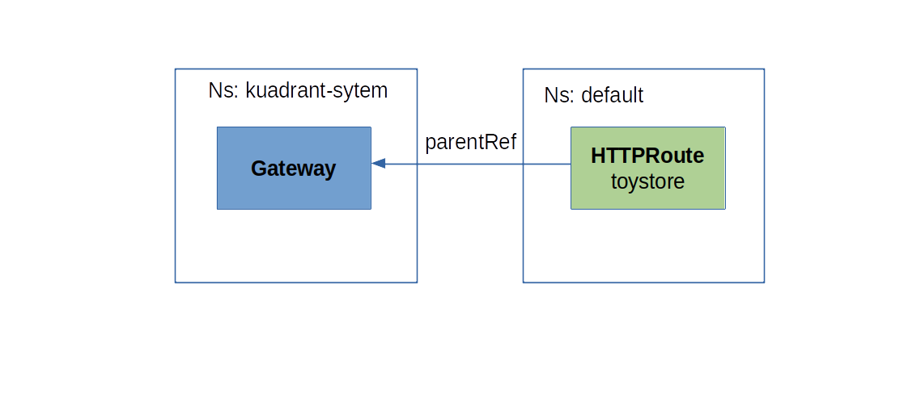

# Multi authenticated Rate Limiting for an Application

This tutorial walks you through an example of how to configure multiple authenticated rate limiting for an application using Kuadrant. 

Authenticated rate limiting, rate limits the traffic directed to an application based on attributes of the client user, who is authenticated by some authentication method. A few examples of authenticated rate limiting use cases are:

- User A can send up to 50rps ("requests per second"), while User B can send up to 100rps.
- Each user can send up to 20rpm ("request per minute").
- Admin users (members of the 'admin' group) can send up to 100rps, while regular users (non-admins) can send up to 20rpm and no more than 5rps.

In this tutorial, we will rate limit a sample REST API called **Toy Store**, an echo service that echoes back to the user whatever attributes it gets in the request. The API exposes an endpoint at `GET http://api.toystore.com/toy`, to mimic an operation of reading toy records.

We will define 2 users of the API, which can send requests to the API at different rates, based on their user IDs. The authentication method used is **API key**.

| User ID | Rate limit                             |
| ------- | -------------------------------------- |
| alice   | 5rp10s ("5 requests every 10 seconds") |
| bob     | 2rp10s ("2 requests every 10 seconds") |

## Prerequisites

- Kubernetes cluster with Kuadrant operator installed. See our [Getting Started](/latest/getting-started) guide for more information.
- [kubectl](https://kubernetes.io/docs/tasks/tools/#kubectl) command line tool.

### Setup environment variables

Set the following environment variables used for convenience in this tutorial:

```bash
export KUADRANT_GATEWAY_NS=api-gateway # Namespace for the example Gateway
export KUADRANT_GATEWAY_NAME=external # Name for the example Gateway
export KUADRANT_DEVELOPER_NS=toystore # Namespace for an example toystore app
```

### Create an Ingress Gateway

Create the namespace the Gateway will be deployed in:

```bash
kubectl create ns ${KUADRANT_GATEWAY_NS}
```

Create a gateway using toystore as the listener hostname:

```sh
kubectl apply -f - <<EOF
apiVersion: gateway.networking.k8s.io/v1
kind: Gateway
metadata:
  name: ${KUADRANT_GATEWAY_NAME}
  namespace: ${KUADRANT_GATEWAY_NS}
  labels:
    kuadrant.io/gateway: "true"
spec:
  gatewayClassName: istio
  listeners:
    - name: http
      protocol: HTTP
      port: 80
      allowedRoutes:
        namespaces:
          from: All
EOF
```

Check the status of the `Gateway` ensuring the gateway is Accepted and Programmed:

```bash
kubectl get gateway ${KUADRANT_GATEWAY_NAME} -n ${KUADRANT_GATEWAY_NS} -o=jsonpath='{.status.conditions[?(@.type=="Accepted")].message}{"\n"}{.status.conditions[?(@.type=="Programmed")].message}{"\n"}'
```

### Deploy the Toy Store API

```sh
kubectl apply -f https://raw.githubusercontent.com/Kuadrant/Kuadrant-operator/main/examples/toystore/toystore.yaml
```

### Create a HTTPRoute to route traffic to the service via Istio Ingress Gateway:



```sh
kubectl apply -f - <<EOF
apiVersion: gateway.networking.k8s.io/v1
kind: HTTPRoute
metadata:
  name: toystore
spec:
  parentRefs:
  - name: ${KUADRANT_GATEWAY_NAME}
    namespace: ${KUADRANT_GATEWAY_NS}
  hostnames:
  - api.toystore.com
  rules:
  - matches:
    - path:
        type: Exact
        value: "/toy"
      method: GET
    - path:
        type: Exact
        value: "/car"
      method: GET
    backendRefs:
    - name: toystore
      port: 80
EOF
```

### Export the gateway hostname and port:

```sh
export KUADRANT_INGRESS_HOST=$(kubectl get gtw ${KUADRANT_GATEWAY_NAME} -n ${KUADRANT_GATEWAY_NS} -o jsonpath='{.status.addresses[0].value}')
export KUADRANT_INGRESS_PORT=$(kubectl get gtw ${KUADRANT_GATEWAY_NAME} -n ${KUADRANT_GATEWAY_NS} -o jsonpath='{.spec.listeners[?(@.name=="http")].port}')
export KUADRANT_GATEWAY_URL=${KUADRANT_INGRESS_HOST}:${KUADRANT_INGRESS_PORT}
```

### Verify the route works:

```sh
curl -H 'Host: api.toystore.com' http://$KUADRANT_GATEWAY_URL/toy -i
# HTTP/1.1 200 OK
```

> **Note**: If the command above fails to hit the Toy Store API on your environment, try forwarding requests to the service and accessing over localhost:
>
> ```sh
> kubectl port-forward -n ${KUADRANT_GATEWAY_NS} service/${KUADRANT_GATEWAY_NAME}-istio 9080:80 >/dev/null 2>&1 &
> export KUADRANT_GATEWAY_URL=localhost:9080
> ```
>
> ```sh
> curl -H 'Host: api.toystore.com' http://$KUADRANT_GATEWAY_URL/toy -i
> # HTTP/1.1 200 OK
> ```

### Enforce authentication on requests to the Toy Store API

Create a Kuadrant `AuthPolicy` to configure the authentication:

```sh
kubectl apply -f - <<EOF
apiVersion: kuadrant.io/v1
kind: AuthPolicy
metadata:
  name: toystore
spec:
  targetRef:
    group: gateway.networking.k8s.io
    kind: HTTPRoute
    name: toystore
  rules:
    authentication:
      "api-key-users":
        apiKey:
          selector:
            matchLabels:
              app: toystore
          allNamespaces: true
        credentials:
          authorizationHeader:
            prefix: APIKEY
    response:
      success:
        filters:
          "identity":
            json:
              properties:
                "userid":
                  selector: auth.identity.metadata.annotations.secret\.kuadrant\.io/user-id
EOF
```

### Verify the authentication works by sending a request to the Toy Store API without API key:

```sh
curl -H 'Host: api.toystore.com' http://$KUADRANT_GATEWAY_URL/toy -i
# HTTP/1.1 401 Unauthorized
# www-authenticate: APIKEY realm="api-key-users"
# x-ext-auth-reason: "credential not found"
```

### Create API keys for users `alice` and `bob` to authenticate:

> **Note:** Kuadrant stores API keys as Kubernetes Secret resources. User metadata can be stored in the annotations of the resource.

```sh
kubectl apply -f - <<EOF
apiVersion: v1
kind: Secret
metadata:
  name: bob-key
  labels:
    authorino.kuadrant.io/managed-by: authorino
    app: toystore
  annotations:
    secret.kuadrant.io/user-id: bob
stringData:
  api_key: IAMBOB
type: Opaque
---
apiVersion: v1
kind: Secret
metadata:
  name: alice-key
  labels:
    authorino.kuadrant.io/managed-by: authorino
    app: toystore
  annotations:
    secret.kuadrant.io/user-id: alice
stringData:
  api_key: IAMALICE
type: Opaque
EOF
```

### Enforce authenticated rate limiting on requests to the Toy Store API

Create Kuadrant `RateLimitPolicy's` to configure rate limiting for Bob and Alice:

### Bob

```sh
kubectl apply -f - <<EOF
apiVersion: kuadrant.io/v1
kind: RateLimitPolicy
metadata:
  name: toystore
spec:
  targetRef:
    group: gateway.networking.k8s.io
    kind: HTTPRoute
    name: toystore
    sectionName: rule-1
  defaults:
    strategy: merge
    limits:
      "bob-limit":
        rates:
        - limit: 2
          window: 10s
        when:
        - predicate: "auth.identity.userid == 'bob'"
EOF
```

### Alice

```sh
kubectl apply -f - <<EOF
apiVersion: kuadrant.io/v1
kind: RateLimitPolicy
metadata:
  name: toystore-alice
spec:
  targetRef:
    group: gateway.networking.k8s.io
    kind: HTTPRoute
    name: toystore
    sectionName: rule-1
  defaults:
    strategy: merge
    limits:
      "alice-limit":
        rates:
        - limit: 5
          window: 10s
        when:
        - predicate: "auth.identity.userid == 'alice'"
EOF
```

> **Note:** It may take a couple of minutes for the RateLimitPolicy to be applied depending on your cluster.

Verify the rate limiting works by sending requests as Alice and Bob.

Up to 5 successful (`200 OK`) requests every 10 seconds allowed for Alice, then `429 Too Many Requests`:

```sh
while :; do curl --write-out '%{http_code}\n' --silent --output /dev/null -H 'Authorization: APIKEY IAMALICE' -H 'Host: api.toystore.com' http://$KUADRANT_GATEWAY_URL/toy | grep -E --color "\b(429)\b|$"; sleep 1; done
```

Up to 2 successful (`200 OK`) requests every 10 seconds allowed for Bob, then `429 Too Many Requests`:

```sh
while :; do curl --write-out '%{http_code}\n' --silent --output /dev/null -H 'Authorization: APIKEY IAMBOB' -H 'Host: api.toystore.com' http://$KUADRANT_GATEWAY_URL/toy | grep -E --color "\b(429)\b|$"; sleep 1; done
```
