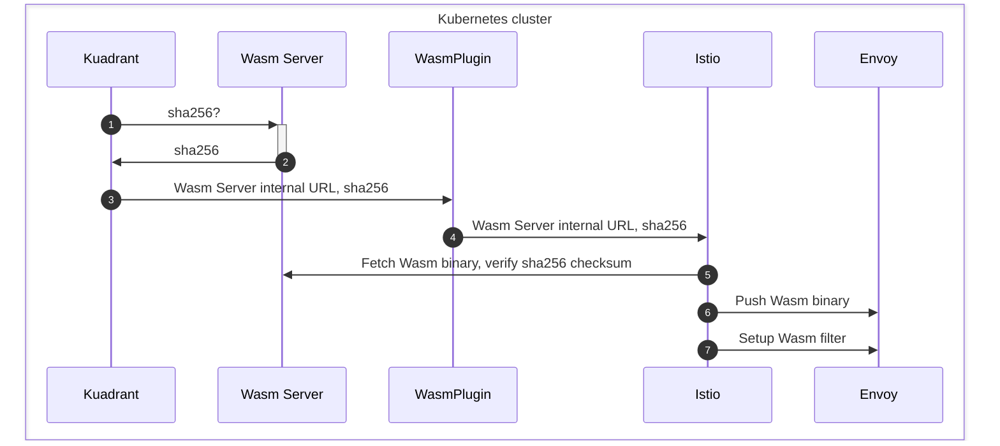

# Kuadrant Wasm Server

### What

Kuadrant's Wasm Server is an HTTP-based static file server that serves
Kuadrant's Wasm module binaries. The wasm module integrates with the gateway in the data plane via
the [Wasm Network filter](https://www.envoyproxy.io/docs/envoy/latest/configuration/listeners/network_filters/wasm_filter).
The source code of the compiled Wasm binaries is hosted at
[Kuadrant's Wasm-Shim project](https://github.com/Kuadrant/wasm-shim)."

### Why

Envoy dynamically loads the Wasm module during runtime, and it is used to extend Envoy's
capabilities. Kuadrant cannot inject a local .wasm file that is accessible by the Envoy proxy.
Instead, Kuadrant tells Envoy to download the Wasm module from a source using existing
Envoy control plane APIs.
The main goal of Kuadrant's Wasm Server component is to be the source of the Wasm module running
inside the same Kubernetes cluster. This way, Envoy does not need to fetch the Wasm module from
external sources, which adds security protection against malicious code injection.

This architecture enables so-called *offline* or *disconnected* installs,
which allow having the entire cluster disconnected from the internet,
at least regarding the Wasm module.

### How

The Wasm Server is implemented using [nginx](https://nginx.org) HTTP server.
The compiled [Kuadrant's Wasm module](https://github.com/Kuadrant/wasm-shim) is being copied
to a docker image containing the nginx server configured to serve it on the `/plugin.wasm` path.

The following sequence diagram shows the workflow:

