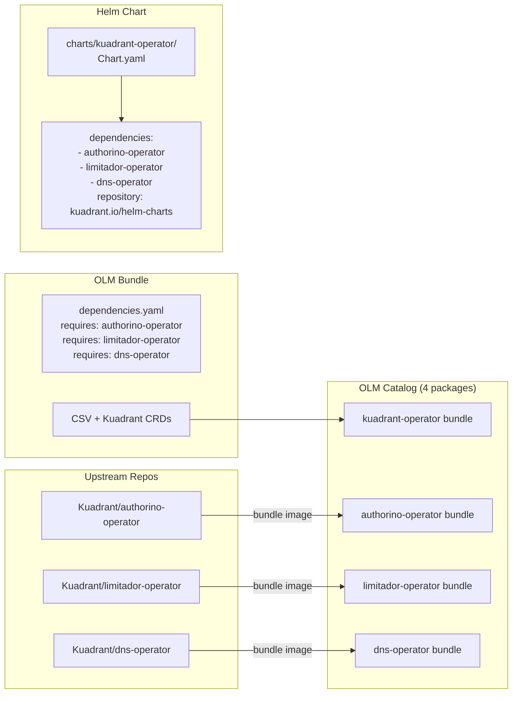
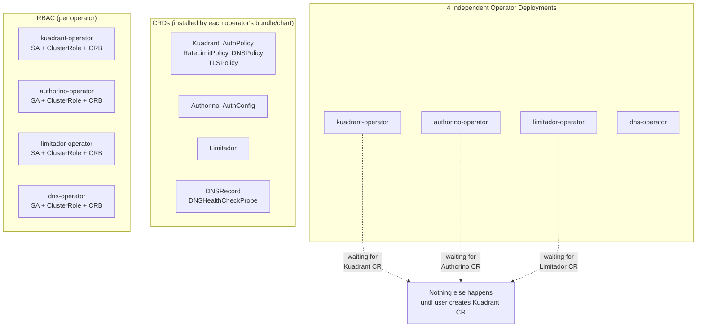
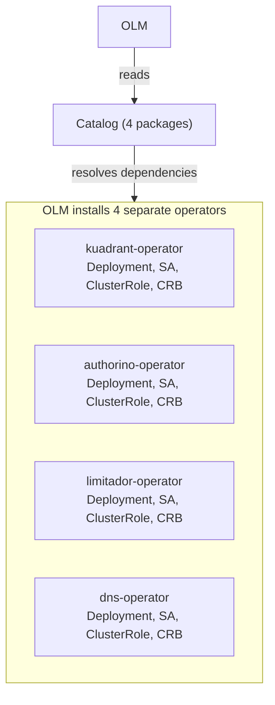
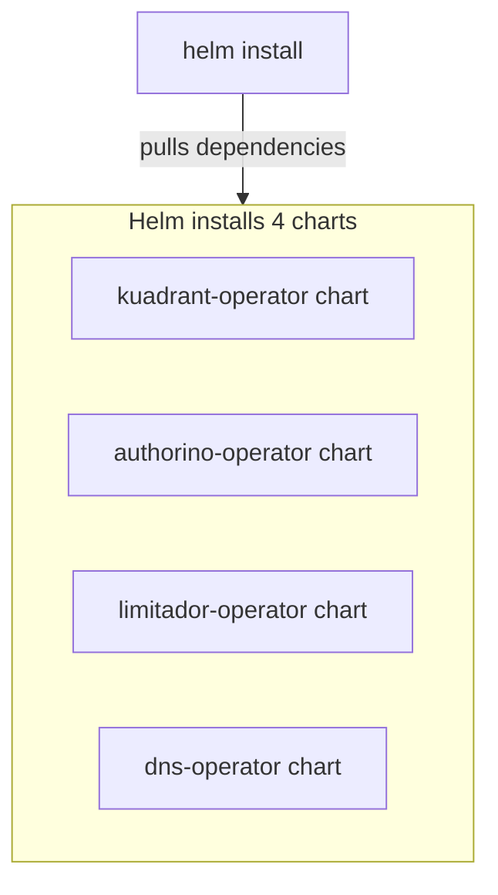
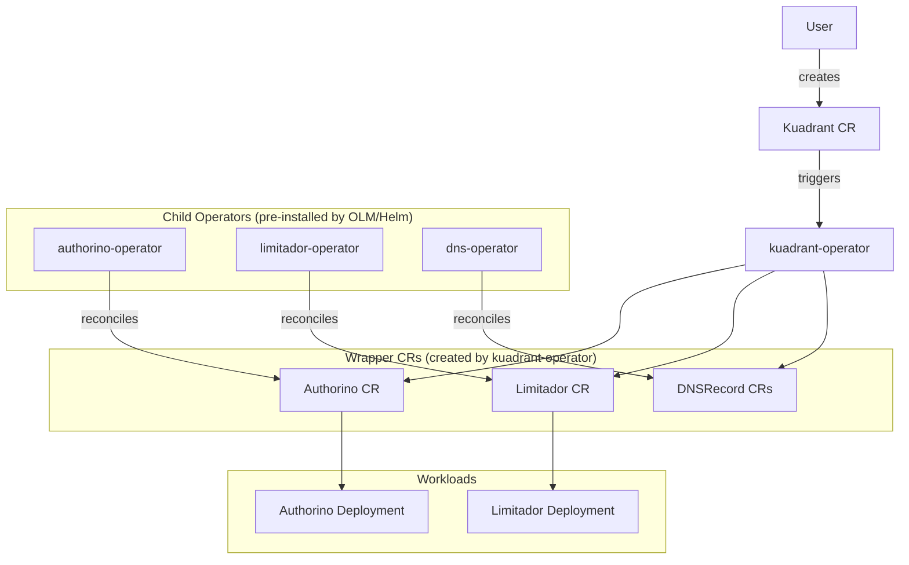
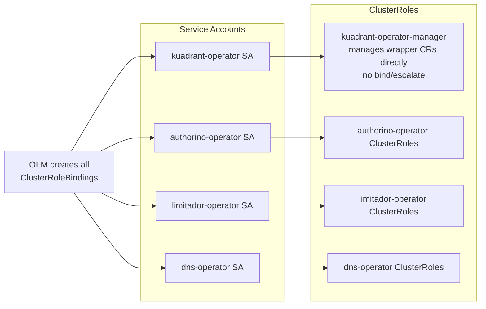
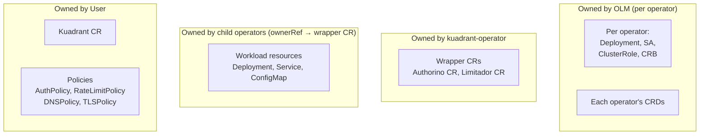

# Current Architecture (main branch)

## Key

| Term | Meaning |
|------|---------|
| **OLM** | Operator Lifecycle Manager — installs and manages operators on OpenShift/Kubernetes |
| **dependencies.yaml** | OLM metadata declaring required child operator packages |
| **CRB** | ClusterRoleBinding |
| **SA** | ServiceAccount |
| **CRD** | CustomResourceDefinition |
| **Wrapper CR** | Authorino/Limitador custom resources created by kuadrant-operator and reconciled by child operators |

## Build-Time: Bundle and Chart Packaging

## Cluster State After Installation (no Kuadrant CR)

## Installation: OLM Path

## Installation: Helm Path

## Runtime: Reconciliation Chain

## RBAC Model

## Resource Ownership

