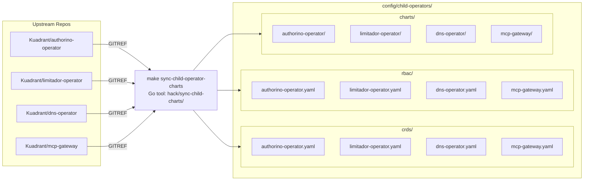
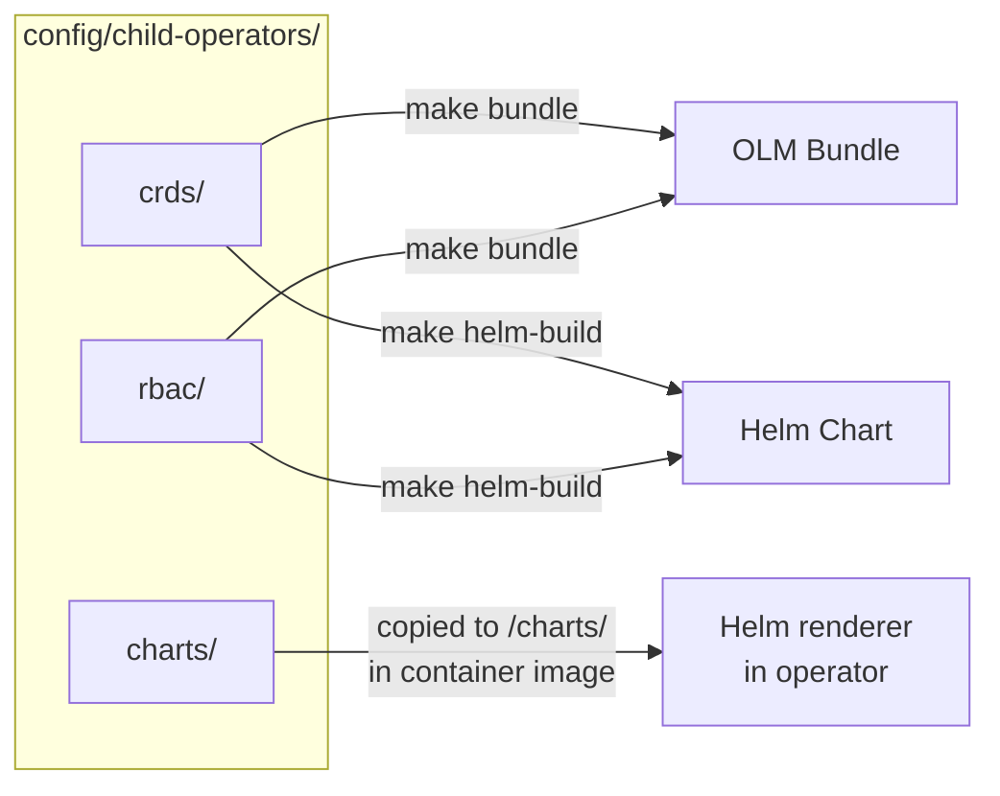
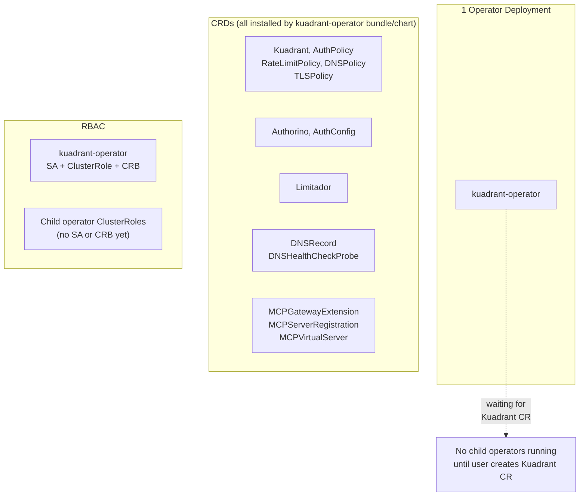
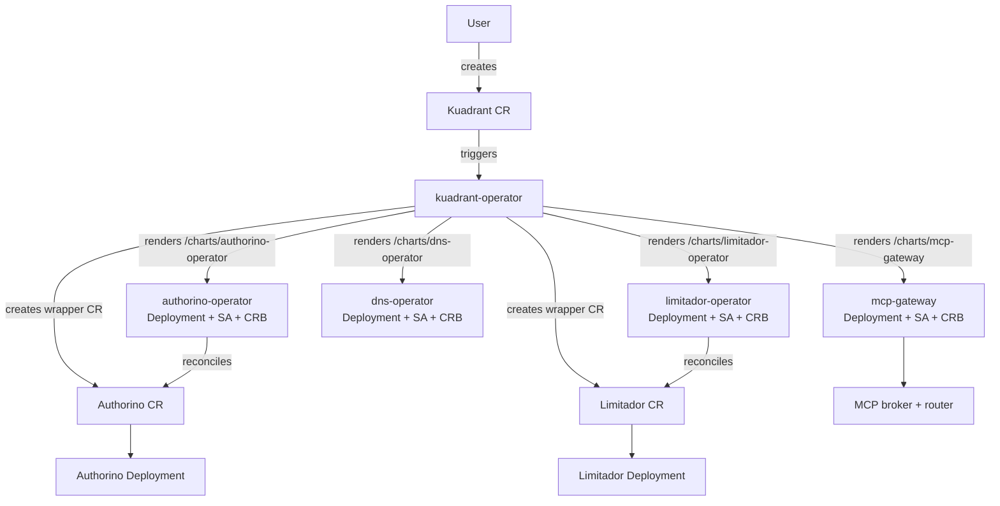
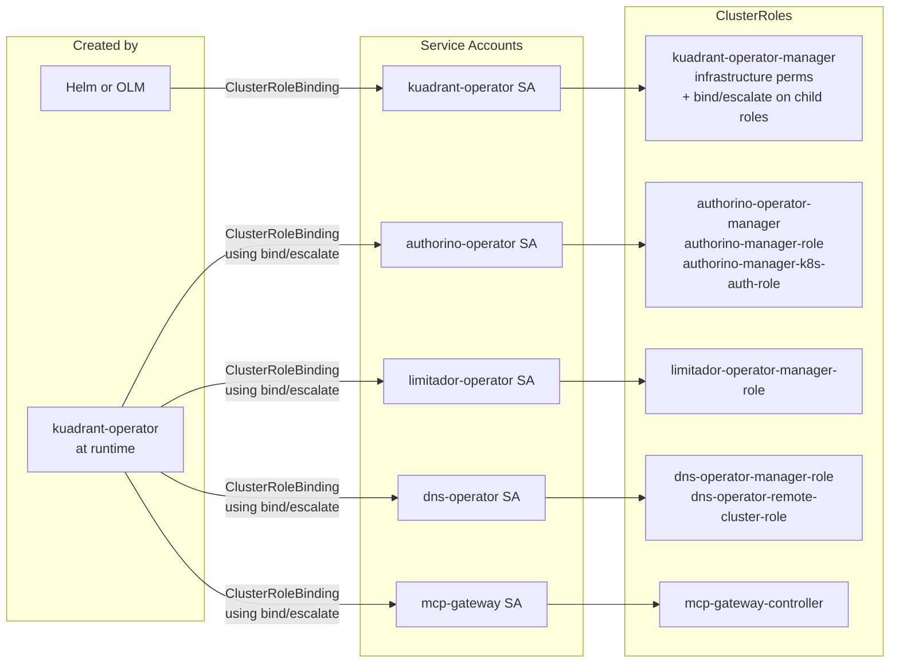
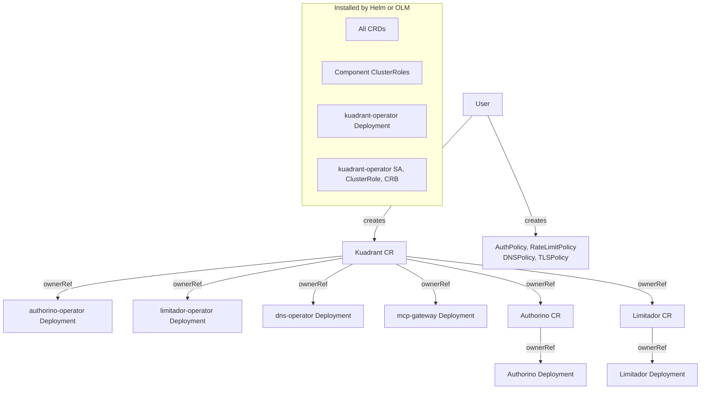

# OLMv1 Phase 1 — Umbrella Operator Architecture

## Key

| Term | Meaning |
|------|---------|
| **SSA** | Server-Side Apply — Kubernetes apply method where the server tracks field ownership per manager |
| **CRB** | ClusterRoleBinding |
| **SA** | ServiceAccount |
| **CRD** | CustomResourceDefinition |
| **bind/escalate** | RBAC verbs that allow creating ClusterRoleBindings to named ClusterRoles without holding all their permissions |
| **GITREF** | Git reference (branch, tag, or SHA) used to pull charts from upstream repos |
| **Wrapper CR** | Authorino/Limitador custom resources created by kuadrant-operator and reconciled by child operators |

## Build-Time: Chart Sync and Packaging

## Cluster State After Installation (no Kuadrant CR)

## Runtime: Reconciliation Chain

## RBAC Model

## Resource Ownership

